prompt 1

# MBS Platform — Enterprise Architecture Analysis

> **Generated**: June 23, 2026  
> **Workspace**: `c:\Users\AD54564\mbsprojects`  
> **Platform**: Lumen Technologies — Miscellaneous Billing System (MBS)  
> **Confidence Level**: HIGH — All findings are code-evidence based.

---

# SECTION 1 — Workspace Discovery

## 1.1 Applications Inventory

| # | Project | Directory | Framework | Java Version | Build Tool | Packaging | Type | Main Purpose |
|---|---------|-----------|-----------|-------------|------------|-----------|------|-------------|
| 1 | **mbs-app-API** (MbsApi) | `mbs-app-API/` | Spring Boot 2.5.6 | Java 1.8 | Maven | WAR | REST API Backend | Core billing engine — payment processing, customer billing, BRIM outbound, approval workflows, tax calculations |
| 2 | **mbs-app-GUI** (mbsgui) | `mbs-app-GUI/mbsgui-master/` | Spring Boot 2.1.8.RELEASE | Java 1.8 | Maven | WAR | JSP/Spring MVC GUI | Web UI for billing operators — customer management, payments, adjustments, reports, bill compute |
| 3 | **ATC Backend** (atc) | `atc/backend/` | Spring Boot 3.2.2 | Java 17 | Maven | WAR | REST API Backend | Aid To Construction project lifecycle — proposals, payments, MBS integration, BRIM sync |
| 4 | **ATC Frontend** | `atc/frontend/` | React 18.2.0 | N/A (JS) | npm / React Scripts 5.0.1 | Static SPA | React Frontend | Modern SPA for ATC engineers and finance — project creation, proposals, payment tracking |

### Application Details

#### 1. mbs-app-API (Core Billing API)

- **Artifact**: `com.lumen:SpringBootMBS:0.0.1-SNAPSHOT`
- **Main Class**: `com.lumen.mbs.SpringBootMbsApplication`
- **Context Path**: `/SpringBootMBS`
- **Database**: Oracle (MBSAPP schema on `svc_mbs001d/t/pp/p`)
- **Secondary DB**: MNET Oracle (`MNET01T` / `SVC_MNET01P`)
- **Source Files**: 335 Java files
- **Key Dependencies**: Spring Data JPA, ojdbc8, Jackson, Apache HttpComponents, SpringDoc OpenAPI, commons-codec, MbsBatch (custom dependency v1.0)
- **Purpose**: Headless REST API providing core billing operations — customer management, payment posting, invoice management, BRIM data exchange, CGS tax integration, MNET approval workflows

#### 2. mbs-app-GUI (Billing Operations Portal)

- **Artifact**: `com.ctl:mbsgui`
- **Main Class**: `com.ctl.mbs.MBSApplication` (extends `SpringBootServletInitializer`)
- **Server Port**: 2019
- **View Technology**: JSP with JSTL (`/WEB-INF/jsp/`)
- **Frontend Libraries**: jQuery 1.9.1, Bootstrap 3.3.6
- **Database**: Oracle (same MBSAPP schema)
- **Messaging**: ActiveMQ (topic: `MBS_BILLING_DATA_TOPIC`)
- **Source Files**: 288 Java files, 74 JSP pages
- **Key Dependencies**: Spring Data JPA, Spring LDAP, ojdbc8, Tomcat Embed Jasper, iTextPDF 5.1.0, Apache POI 4.1.2, ActiveMQ, JavaMail
- **CI/CD**: Jenkins pipeline, Docker (Tomcat 9 base), Kubernetes
- **Purpose**: Full operator-facing web application for billing analysts — customer search, payment entry, bill computation, tax management, adjustments, PDF bills, Excel reports, approval workflows

#### 3. ATC Backend (Aid To Construction API)

- **Artifact**: `com.lumen.atc:atc:0.0.1-SNAPSHOT`
- **Main Class**: `com.lumen.atc.AtcApplication`
- **Database**: Oracle (separate ATC schema on same `svc_mbs001d` instance)
- **Source Files**: 218 Java files
- **Key Dependencies**: Spring Boot 3.2.2, Spring Data JPA, ojdbc11, PDFBox 3.0.1, Tess4j 5.11.0 (OCR), Apache POI 5.2.3, Spring Mail, Caffeine Cache, Spring LDAP, Lombok
- **Purpose**: Manages the "Aid To Construction" project lifecycle — proposal generation, Adobe Sign integration, payment URL generation, billing data sync to MBS, automated report scheduling

#### 4. ATC Frontend (React SPA)

- **Package**: React 18.2.0 with React Router DOM v6
- **HTTP Client**: Axios 1.6.7
- **Dev Proxy**: `http://localhost:8080`
- **Deployment Path**: `/atc` (production via Tomcat)
- **Pages**: Login, Dashboard, Engineer, Finance, Addendum
- **Purpose**: Modern user interface for ATC engineers and finance staff — project creation, proposal review, payment tracking, project amendments

---

## 1.2 Package Namespace Mapping

| Application | Root Package | Note |
|-------------|-------------|------|
| mbs-app-API | `com.lumen.mbs` | Lumen-branded (post-rebrand) |
| mbs-app-GUI | `com.ctl.mbs` | CTL-branded (legacy CenturyLink namespace, pre-rebrand) |
| ATC Backend | `com.lumen.atc` | Lumen-branded (newest application) |

---

# SECTION 2 — High Level Design (HLD)

## 2.1 Overall Business Purpose

The MBS Platform is a **Miscellaneous Billing System** used at Lumen Technologies (formerly CenturyLink) for managing **non-standard/miscellaneous billing** for telecom carrier services. The platform handles:

1. **Customer lifecycle management** — Creating and maintaining billing customers with addresses, tax info, and billing configurations
2. **Invoice generation and billing** — Computing charges, taxes, generating PDF bills, managing bill cycles
3. **Payment processing** — Posting payments against invoices, tracking balance history, handling overpayments and advance payments
4. **Tax computation** — Integration with CGS (Corporate Geo-coding System) for address-based tax rate retrieval
5. **Adjustment management** — Invoice cancellations, credit/debit adjustments with phrase code tracking
6. **Approval workflows** — MNET-based hierarchical approval routing with delegation support
7. **BRIM integration** — Outbound data feed to SAP BRIM (Billing and Revenue Innovation Management) for financial consolidation
8. **Aid To Construction (ATC)** — Managing construction project proposals, customer payments, and billing for telecom infrastructure projects

## 2.2 System Architecture Diagram

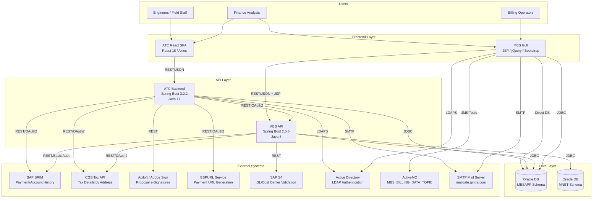

## 2.3 API Communication Flow

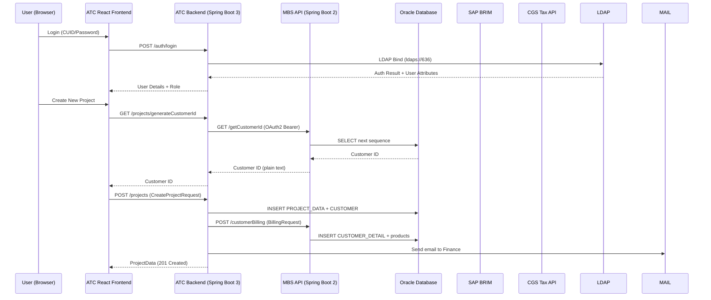

## 2.4 Database Architecture

All three backend applications connect to the **same Oracle database cluster** but use different schemas/tables:

| Database Instance | Schema | Used By | Purpose |
|-------------------|--------|---------|---------|
| `svc_mbs001d` (Dev) / `svc_mbs001p` (Prod) | `MBSAPP` | MBS API, MBS GUI, ATC Backend | Core billing tables |
| `MNET01T` (Test) / `SVC_MNET01P` (Prod) | `MBSUSER` | MBS API | User hierarchy, approval limits, delegation |

**Core Oracle Tables (Evidence from Entity/Repository classes)**:

| Table | Application | Purpose |
|-------|-------------|---------|
| `CUSTOMER_DETAIL` | MBS API / GUI | Customer master (40+ columns) |
| `BILL_INV_FILE` | MBS API / GUI | Invoice records |
| `BILL_BALHISTORY` | MBS API / GUI | Invoice balance tracking |
| `BILL_PAYMENT` | MBS API / GUI | Payment transactions |
| `BILL_ADJUSTMENTS` | MBS API / GUI | Adjustment records |
| `MBS_AUDIT_INFO` | MBS API / GUI | Audit trail |
| `ERROR_LOG` | MBS API / GUI | Error tracking |
| `OUTBOUND_JSON` | MBS API | BRIM outbound data storage |
| `INBOUND_JSON` | MBS API | BRIM inbound data storage |
| `STATE_DETAIL` | MBS API / GUI / ATC | State/tax jurisdiction info |
| `MBS_APPROVAL_LIMIT` | MBS API | Approval limit by job grade |
| `MBS_DELIGATIONS` | MBS API | User delegation rules |
| `COST_CENTER_MAPPING` | MBS API | Cost center validation |
| `ENTP_ID_MAPPING` | MBS API | Enterprise ID mapping (legacy to new) |
| `PROJECT_DATA` | ATC Backend | ATC project records |
| `CUSTOMER` | ATC Backend | ATC customer billing/contact info |
| `PROPOSAL` | ATC Backend | Generated proposals with PDF BLOB storage |
| `PAYMENT` | ATC Backend | ATC payment transactions |
| `BILLING_DATA` | ATC Backend | Billing sync data |
| `WORKFLOW_TRANSITION` | ATC Backend | Project status transition history |
| `USER_ROLE` | ATC Backend | Role-based access |
| `NOTES` | ATC Backend | Project notes |
| `CPPM_MASTER_DATA` | ATC Backend | CPPM project/WBS data |
| `REPORT_CONFIG` | ATC Backend | Scheduled report configurations |
| `BATCH_TRANSACTION` | ATC Backend | Batch processing records |
| `APP_PROPERTIES` | ATC Backend | Runtime-configurable properties (cached) |
| `ADDRESS_TEMPLATE` | ATC Backend | Saved address templates |

## 2.5 Authentication Flow

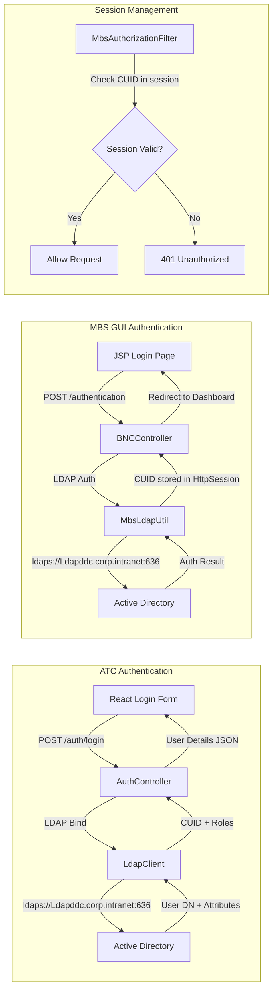

**Key Authentication Details** (from code evidence):

- **LDAP URL**: `ldaps://Ldapddc.corp.intranet:636` (SSL)
- **ATC App DN**: `ATCUSER@ctl.intranet`
- **MBS App DN**: `mbsapp@ctl.intranet`
- **Search Base**: `DC=ctl,DC=intranet`
- **Method**: Simple LDAP bind authentication
- **ATC Security Config**: `SecurityConfig` permits all endpoints (`permitAll()`) — relies on frontend session management
- **MBS GUI**: `MbsAuthorizationFilter` — servlet filter checking CUID in HttpSession, returns 401 on expiry
- **Session Timeout (MBS GUI)**: 600 minutes (10 hours) — configured in `application.properties`

## 2.6 External Integrations

| Integration | Protocol | Auth | Used By | Purpose |
|-------------|----------|------|---------|---------|
| **SAP BRIM** (Payment History) | REST/HTTPS | Basic Auth (`MBSUSER`) | MBS API, ATC Backend | Payment transaction history, account history, write-off history |
| **CGS Tax API** | SOAP over REST/HTTPS | OAuth2 Client Credentials | MBS API, ATC Backend | Tax rate retrieval by address (geocode-based) |
| **BSPURL Service** | REST/HTTPS | OAuth2 Bearer | ATC Backend | Generate secure payment URLs (PURLs) for customer payments |
| **Agiloft / Adobe Sign** | REST/HTTPS | API Token | ATC Backend | Proposal e-signature workflow |
| **SAP S4** | REST/HTTPS | Unknown | MBS API | GL account, cost center, WBS element validation |
| **MNET Database** | JDBC | Database credentials | MBS API | User hierarchy, approval limits, delegation management |
| **Active Directory** | LDAPS (port 636) | Simple bind | MBS GUI, ATC Backend | User authentication and attribute lookup |
| **ActiveMQ** | JMS/TCP (port 61616) | admin/admin | MBS GUI | Pub/sub messaging for billing data events |
| **SMTP Mail** | SMTP (port 25) | None | ATC Backend | Email notifications (project creation, proposals) |

## 2.7 Deployment Architecture

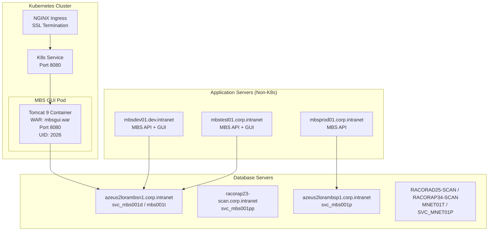

**Deployment Details (from Dockerfile, deployment.tmpl, Jenkinsfile)**:

- **MBS GUI**: Containerized Kubernetes deployment
  - Base image: `nexusprod.corp.intranet:4567/devbaseimages/development_base_images/tomcat9:2021Q2`
  - Runs as non-root UID/GID 2026
  - Read-only root filesystem with emptyDir volumes for logs/temp/work
  - Resource limits: 250m CPU / 2048Mi memory
  - NGINX Ingress with SSL termination
  - Hostname pattern: `${KUBERNETES_PREFIX}-${APP_ACTIVE_PROFILE}.${CLUSTER_DOMAIN}`
- **MBS API**: WAR deployed to Tomcat (traditional deployment to `mbsdev01`, `mbstest01`, `mbsprod01`)
- **ATC Backend**: WAR packaging (deployment method not specified in code — likely similar Tomcat deployment)
- **ATC Frontend**: Built React SPA served as static files from ATC Backend (`/atc` context path in production)

## 2.8 Environment Architecture

| Environment | MBS API Host | MBS GUI Host | Database | MNET DB | ActiveMQ |
|-------------|-------------|-------------|----------|---------|----------|
| **Dev** | `mbsdev01.dev.intranet:8080` | K8s cluster (dev profile) | `azeus2lorambsn1:1521/svc_mbs001d` | `RACORAD25-SCAN:1521/MNET01T` | `mbsdev01.dev.intranet:61616` |
| **Test** | `mbstest01.corp.intranet:8080` | K8s cluster (test profile) | `azeus2lorambsn1:1521/mbs001t` | `RACORAD25-SCAN:1521/MNET01T` | `mbstest01.corp.intranet:61616` |
| **Pre-Prod** | Separate instance | K8s cluster (pp profile) | `racorap23-scan:1521/svc_mbs001pp` | Unknown | Unknown |
| **Prod** | `mbsprod01.corp.intranet:8080` | K8s cluster (prod profile) | `azeus2lorambsp1:1521/svc_mbs001p` | `RACORAP34-SCAN:1521/SVC_MNET01P` | Unknown |

---

# SECTION 3 — Low Level Design (LLD)

## 3.1 mbs-app-API (Core Billing API)

### Controllers (10 REST Controllers)

| Controller | Base Path | Key Endpoints | Responsibilities |
|-----------|-----------|---------------|------------------|
| `CustomerController` | `/` | `GET /customer`, `GET /getCustomerId` | Customer lookup, next customer ID generation |
| `CustomerDetailController` | `/` | `GET /customerDetails` | Customer payment info, balance queries |
| `CustomerBillingController` | `/` | `POST /customerBilling`, `GET /generatebillPreviewPdf` | Create/update customers and products in billing system, PDF bill preview generation |
| `PostPaymentController` | `/` | `POST /postpayment` | Payment processing with duplicate detection, invoice balance updates |
| `AdjustmentController` | `/` | `POST /cancelInvoice` | Invoice cancellation, adjustment creation |
| `MbsTaxController` | `/` | `GET /Cgs-AccesToken`, `GET /Cgs-prod-AccesToken` | OAuth token generation for CGS Tax API |
| `MbsFileController` | `/` | `POST /sendFile` | File upload handling for billing data |
| `DataMappingController` | `/` | `GET /getEntpIDMapping`, `GET /getCostCenterMapping`, `GET /validateGLRac` | Enterprise ID, cost center, GL account validation |
| `MnetController` | `/` | `GET /AssignDetails`, `GET /GetHirearchyList`, `GET /getUserMnetDetails`, `GET /DeligationDetails` | MNET approval routing, user hierarchy, delegation management |
| `MbsBrimFileController` | `/` | `POST /MbsBrimFileDetails`, `POST /processOutbound`, `POST /MbsBrimAccrualsDetails` | BRIM data retrieval, outbound JSON generation, accruals, payment/account/write-off history |

### Services (60+ Services)

**Core Business Services:**

| Service | Implementation | Purpose |
|---------|---------------|---------|
| `CustomerService` | `CustomerServiceImpl` | Customer balance, payment history, enterprise ID lookup |
| `MbsPaymentService` | `MbsPaymentServiceImpl` | Payment processing, duplicate detection, advance payments, expense posting |
| `BillBalHistoryService` | `BillBalHistoryServiceImpl` | Invoice balance updates, reversions, history backup |
| `AuditInfoService` | `AuditInfoServiceImpl` | Audit trail logging for all operations |
| `ApprovalService` | `ApprovalServiceImpl` | MNET-based approval routing, delegation management |
| `BillingRequestService` | (direct impl) | Customer/product validation, action handling (CREATE/UPDATE/DELETE) |
| `CustomerDetailService` | `CustomerDetailServiceImpl` | Customer entity CRUD operations |
| `ProductDetailService` | `ProductDetailServiceImpl` | Product entity management |
| `ValidateRequest` | `ValidateRequestImpl` | Input validation for billing requests |
| `EntpIDMappingService` | (direct impl) | Enterprise ID mapping (legacy to new systems) |
| `CostCenterMappingService` | (direct impl) | Cost center validation with S4 |
| `CustomerIdService` | (direct impl) | Sequential customer ID generation |

**BRIM Services:**

| Service | Purpose |
|---------|---------|
| `MbsBrimService` / `MbsBrimServiceImpl` | Core BRIM data retrieval from invoice tables |
| `MbsBrimOutboundService` / `MbsBrimOutboundServiceImpl` | Outbound JSON generation and validation |
| `MbsBrimInboundService` / `MbsBrimInboundServiceImpl` | Inbound JSON processing |
| `MbsBrimAccrualsService` / `MbsBrimAccrualsServiceImpl` | Accrual calculations |
| `MbsBrimChargeService` / `MbsBrimChargeServiceImpl` | Charge calculations |
| `MbsBrimExpenseService` / `MbsBrimExpenseServiceImpl` | Expense processing |
| `MbsBrimTaxService` / `MbsBrimTaxServiceImpl` | Tax calculations with CGS integration |
| `MbsBrimDailyFeedService` / `MbsBrimDailyFeedServiceImpl` | Daily feed processing |
| `MbsBrimPaymentTransactionsService` | Payment history retrieval from BRIM API |
| `MbsBrimWriteOffTransactionsService` | Write-off tracking from BRIM API |
| `MbsBrimAccountTransactionsService` | Account transaction history from BRIM API |

### Repositories (45+ JPA Repositories)

| Repository | Key Custom Queries | Pattern |
|------------|-------------------|---------|
| `CustomerRepository` | Find by customer ID, system name | JPA + Native |
| `BillInvoiceRepository` | Invoice master lookups | JPA + Native |
| `BillBalHistoryRepository` | Balance history tracking | JPA + @Modifying |
| `PaymentDetailRepository` | Payment records, monthly aggregations | 40+ custom queries |
| `BillAdjustmentRepository` | Adjustments, advance/overpayment tracking | 70+ custom queries |
| `AuditInfoRepository` | Audit log inserts | JPA |
| `ErrorLogRepository` | Error tracking | JPA |
| `OutboundJsonRepository` / `InboundJsonRepository` | JSON storage/retrieval | JPA |
| `StateDetailRepository` | State/tax jurisdiction data | JPA |
| `MbsApprovalLimitRepository` | Approval limits by job grade | JPA |
| `DeligationDetailsRepository` | User delegation rules | JPA |
| `EntpIDMappingRepository` | Enterprise ID mapping | JPA |
| `CostCenterMappingRepository` | Cost center validation | JPA |
| `ExpenseVoucherRepository` / `ExpenseComputeRepository` | Expense tracking | JPA |
| `VertexTaxCatRepository` | Vertex tax categories | JPA |
| `BrimComputeRepository` | BRIM computation data | JPA |

### Entities (70+ JPA Entities)

**Key entities with composite primary keys (using `@IdClass`):**

| Entity | Table | Key Fields | Notable Columns |
|--------|-------|------------|-----------------|
| `CustomerDetail` | `CUSTOMER_DETAIL` | Composite (custId, systemName) | 40+ fields: name, addresses, tax info, billing config |
| `BillInvoiceDetails` | `BILL_INV_FILE` | Composite | Invoice number, amounts, dates, status |
| `BillBalHistory` | `BILL_BALHISTORY` | Composite | Invoice balance tracking over time |
| `PaymentDetails` | `BILL_PAYMENT` | Composite (paymentSeqNum, systemName) | Payment amount, mode, date, status |
| `BillAdjustments` | `BILL_ADJUSTMENTS` | Composite (adjustmentSeqNum, systemName) | Adjustment amount, phrase code, reason |
| `AuditInfo` | `MBS_AUDIT_INFO` | Composite | Request/response JSON, timestamps |
| `ErrorLog` | `ERROR_LOG` | Composite | Error message, reprocess indicator |
| `OutboundJson` / `InboundJson` | `OUTBOUND_JSON` / `INBOUND_JSON` | Composite | JSON data, processing status |
| `StateDetail` | `STATE_DETAIL` | Composite | State abbreviation, tax jurisdictions |
| `MbsApprovalLimit` | `MBS_APPROVAL_LIMIT` | Composite | Job code, approval amount |
| `DeligationDetails` | `MBS_DELIGATIONS` | Composite | From user, to user, dates |

### Configurations

| Class | Type | Details |
|-------|------|---------|
| `BrimConfig` | `@Configuration` | Loads `brim-config.properties` — 100+ transaction type and adjustment code mappings |
| `BrimTransactionConfigService` | Service | BRIM transaction config management |
| `GlobalExceptionHandler` | `@ControllerAdvice` | Handles `EntpIDNotFoundException`, `GLRacNotFoundException`, `CostCenterIdNotFoundException` |

### Utilities

| Class | Purpose |
|-------|---------|
| `SSLUtil` | SSL certificate handling for external API calls |
| `OAuthTokenGenerator` | CGS OAuth token generation with client credentials |
| `MiscUtils` | Date/string utilities |
| `BNCAppConstants` | Application constants (payment modes, statuses, URLs) |
| `JsonToStringConverter` | Request/response JSON serialization for logging |
| `PaymentHistoryApi` | External payment history integration client |
| `TaxExemptCodeMap` | Tax exemption code mapping |
| `TokenCache` | OAuth token caching |
| `ApiService` | Generic REST API integration helper |

---

## 3.2 mbs-app-GUI (Billing Operations Portal)

### Controllers (16 Controllers)

| Controller | Key Endpoints | Responsibilities |
|-----------|---------------|------------------|
| `CustomerController` | Customer list, history (invoice/payment/tax/adjustment/voucher) | Customer CRUD and comprehensive history |
| `PaymentController` | Carrier details, invoice lookups, amount validation | Payment entry and processing |
| `BillComputeController` | Charges, taxes, adjustments, 3-month history | Bill calculation and computation |
| `ApprovalController` | Assignment, approval status updates | Invoice/expense approval workflows |
| `ReportController` | Canned reports, Excel/PDF export | Report generation and download |
| `AdjustmentController` | Adjustment creation and management | Adjustment entry |
| `ErrorCorrectionController` | Error logs, reprocessing | Error review and correction |
| `ExpenseController` | Expense tracking and entry | Expense management |
| `NotesController` | Notes CRUD | Notes per customer/invoice |
| `ReferenceTableController` | Reference data maintenance | Master data administration |
| `OCCController` | OCC billing entry | OCC (Other Charges and Credits) |
| `BillControlController` | Bill cycle control | Bill run management |
| `MarketMessageController` | Market message management | Customer-facing message templates |
| `EmpRegController` | Employee registration | User registration |
| `BNCController` | General BNC operations, login/authentication | Main entry point, LDAP auth |

### Services (30+ Services)

| Service | Purpose |
|---------|---------|
| `CustomerService` / `CustomerServiceImpl` | Customer data management, master updates |
| `PaymentDetailsService` / `PaymentDetailsServiceImpl` | Payment CRUD, monthly history, balance updates |
| `BCAdjustmentService` / `BCAdjustmentServiceImpl` | Adjustment history, monthly aggregations |
| `BillInvoiceService` / `BillInvoiceServiceImpl` | Invoice management |
| `TaxComputeService` / `TaxComputeServiceImpl` | Tax calculations (inter/intra rate, exemptions) |
| `CannedReportService` | Report generation with parameterized queries |
| `BillBalHistoryService` | Balance history tracking |
| `BCPdfBillService` | PDF bill generation using iTextPDF |
| `AuditInfoService` | Audit trail recording |
| `ErrorLogService` | Error handling and reprocessing |
| `CurrUsageService` | Usage tracking |
| `CustomerLegacyDataService` | Legacy system data migration/integration |
| `TaxExemptionService` | Tax exemption rule management |
| `RestClient` | Helper for REST API calls to MBS API backend |

### Repositories

| Repository | Key Queries | Pattern |
|------------|------------|---------|
| `CustomerRepository` | `findByCustId`, `getNonBCStateDetails`, `masterUpdateCustomer` | @Query (native + JPQL) |
| `PaymentDetailRepository` | Monthly aggregations, status filters, amount summations | 40+ @Query methods |
| `BCAdjustmentRepository` | Monthly adjustments, advance/overpayment tracking | 50+ @Query methods |
| `BillInvoiceRepository` | Invoice lookups | @Query |
| `BillBalHistoryRepository` | Balance history | @Query |
| `StateDetailRepository` | State master data | @Query |
| `AdjPhraseCodeRepository` | Adjustment phrase codes | @Query |
| `ErrorLogRepository` | Error logs with reprocess indicator | @Query |
| `AssignDetailsRepository` | Assignment tracking | @Query |

### Entities (92 JPA Entities)

All entities use `@IdClass` composite keys combining `systemName` + entity-specific fields. Key entities include: `CustomerDetail`, `BCAdjustment`, `PaymentDetails`, `BillInvoice`, `BillBalHistory`, `StateDetail`, `AdjPhraseCode`, `AssignDetails`, `ExpenseVoucher`, `ErrorLog`, `AuditInfo`, `TaxCompute`, `TaxRate`, `TaxExemption`, `ProductServiceDetail`, `ProductServiceRate`, `ProductServiceCategory`, `BillControl`, `BillCompute`, `CannedReports`, `CustomerTemplate`, `MbsApprovalLimit`, `DeligationDetails`, `OccDetail`, `JournalReference`, and more.

### DTOs (46 DTOs)

Key DTOs: `CustomerDTO`, `BCAdjustmentDTO`, `PaymentDetailsDTO`, `BillInvoiceDTO`, `BCPdfBillDTO`, `TaxComputeDTO`, `OccDetailDTO`, `ExpenseVoucherDTO`, `CannedReportDTO`, `AuditInfoDTO`, `ErrorLogDTO`

### Configurations

| Class | Purpose |
|-------|---------|
| `MbsMessageJMSConfig` | ActiveMQ connection factory, JMS template, pub-sub for `MBS_BILLING_DATA_TOPIC` |
| `MBSApplication` | Main app class with `ViewResolver` (JSP prefix/suffix) and `RestTemplate` bean |

### Utilities

| Class | Purpose |
|-------|---------|
| `MbsLdapUtil` | LDAP authentication and user search against Active Directory |
| `MbsAuthorizationFilter` | Servlet filter — session-based authorization, 401 on expired sessions |
| `MbsSessionTrackingUtil` | Session validation (checks CUID in HttpSession) |
| `TimestampUtil` | Date conversions (ISO 8601 ↔ Java Date) |
| `ExcelFileUtil` | Excel template generation, workbook handling |
| `EmailUtility` | Email sending operations |
| `BNCAppConstants` | Application-wide constants (system names, status codes, tax jurisdictions, phrase codes) |
| `BNCExcelGenerator` | Excel report generation |
| `RestClient` | REST client for MBS API backend calls |
| `GenericQueryForReferenceTable` | Dynamic SQL query builder for reference table maintenance |

### JSP Views (74 Pages)

Key JSP pages: `Login.jsp`, `dashboard.jsp`, `MenuBar.jsp`, `PaymentPage.jsp`, `PaymentSummary.jsp`, `BillCompute.jsp`, `PdfBill.jsp`, `ShowPdfBill.jsp`, `Report.jsp`, `OCC.jsp`, `Adjustment.jsp`, `Admin.jsp`, `ReferenceTable.jsp`, `Registration.jsp`

---

## 3.3 ATC Backend (Aid To Construction API)

### Controllers (6 REST Controllers)

| Controller | Base Path | Key Endpoints | Responsibilities |
|-----------|-----------|---------------|------------------|
| `AuthController` | `/auth` | `POST /auth/login`, `GET /auth/mnetUserDetails` | LDAP authentication, MNET user attribute retrieval |
| `ProjectDataController` | `/projects` | `POST /projects`, `GET /projects/generateCustomerId`, `GET /projects/getCountries` | Project CRUD, MBS customer ID generation, address template management |
| `ProjectDashboardController` | `/dashboard` | `GET /dashboard/years`, `GET /dashboard/projects` | Year-based project search, project details retrieval |
| `CPPMMasterDataController` | `/cppm` | `GET /cppm/search`, `GET /cppm/autocomplete` | CPPM data search, WBS autocomplete (cached) |
| `ProjectFinanceController` | `/finance` | `POST /finance/sendPurl`, `POST /finance/syncBilling`, `POST /finance/updateInvoice`, `POST /finance/submitRefund` | Payment PURL generation, billing sync to MBS, invoice management, refund submission to BRIM |
| `DocumentController` | `/documents` | `POST /documents/compare` | PDF document comparison using Tesseract OCR |

### Services (30+ Services)

| Service | Purpose |
|---------|---------|
| `AuthService` | LDAP authentication, MNET user details retrieval |
| `ProjectDataService` / `ProjectDataServiceImpl` | Project CRUD, status management, email notifications, MBS customer ID generation |
| `ProjectDashboardService` | Dashboard data aggregation, year-based searches |
| `ProposalService` | Proposal generation (PDF with PDFBox), signing workflow tracking, PURL flag management |
| `PaymentService` | Payment record management, balance calculations |
| `ProjectEditService` | Composite project edits (cancellation, SOW changes, billing updates) with `@Transactional` |
| `CustomerService` | ATC customer data management |
| `CPPMMasterDataService` / `CPPMMasterDataServiceImpl` | CPPM data search with Caffeine-cached autocomplete |
| `BillingRequestBuilderService` | Constructs `BillingRequest` objects for MBS sync (CREATE/UPDATE/DELETE operations) |
| `BillingDataService` | Billing data entity management |
| `EmailService` | SMTP email notifications |
| `ReleaseProjectService` / `ReleaseProjectServiceImpl` | Project release workflow |
| `WorkflowTransitionService` | Status transition logging |
| `ButtonConfigService` | Dynamic UI button configuration based on project status |
| `StateDetailService` / `StateDetailCacheService` | State master data with caching |
| `DocumentComparisonService` | PDF comparison using Tesseract OCR |
| `ExcelFileProcessorService` | Excel file processing for bulk operations |
| `DirectoryWatcher` | File system monitoring for input files |
| `MasterProjectService` | Master project data management |
| `BatchTransactionService` | Batch transaction tracking |
| `AppPropertiesCacheService` | Runtime-configurable properties loaded from database table `APP_PROPERTIES` |
| `ReportSchedulerService` | Cron-based report scheduling from `REPORT_CONFIG` table |
| `ReportExecutorService` | Report execution logic |
| `ReportExcelService` | Excel report generation |
| `ReportEmailService` | Report email distribution |
| `BRIMPaymentScheduler` | Scheduled BRIM payment info polling |
| `MBSPaymentHistoryScheduler` | Scheduled MBS payment history sync |

### Service Adaptors (External Integration Layer)

| Adaptor | External System | Operations |
|---------|----------------|------------|
| `MBSServiceAdaptor` | MBS API | OAuth2 token management, customer ID generation, billing request submission, ACH config lookup, customer transaction retrieval |
| `BRIMServiceAdaptor` | SAP BRIM | Customer active status verification, payment history retrieval, refund submission |
| `BSPURLServiceAdaptor` | BSPURL Service | Secure payment URL (PURL) generation and delivery via email |
| `CgsAdapter` | CGS Tax API | Tax detail retrieval by address (geocode-based) |
| `AgiloftAdaptor` | Agiloft / Adobe Sign | Proposal e-signature workflow (login, record creation, PDF attachment) |

### Repositories (12+ JPA Repositories)

| Repository | Key Queries | Pattern |
|------------|------------|---------|
| `ProjectDataRepository` | Status filtering, year-based queries | JPA + @Query |
| `ProposalRepository` | PDF retrieval, signing status | JPA |
| `PaymentRepository` | Payment aggregation, duplicate checks | JPA + @Query |
| `CustomerRepository` | Customer lookups | JPA |
| `CppmMasterDataRepository` | Cached autocomplete, project/WBS search | JPA + @Cacheable |
| `BillingDataRepository` | Billing sync records | JPA |
| `WorkflowTransitionRepository` | Status transition history | JPA |
| `UserRoleRepository` | Role-based access queries | JPA |
| `NotesRepository` | Project notes | JPA |
| `StateDetailRepository` | State/tax info | JPA |
| `ReportConfigRepository` | Active report configurations | JPA |
| `BatchTransactionRepository` | Batch records | JPA |
| `AddressTemplateRepository` | Saved address templates | JPA |
| `AppPropertiesRepository` | Runtime properties | JPA |

### Entities (13 JPA Entities)

| Entity | Table | Purpose |
|--------|-------|---------|
| `ProjectData` | `PROJECT_DATA` | Main project record (projectId, WBS, status, dates, amounts) |
| `Customer` | `CUSTOMER` | Billing/contact information for ATC customers |
| `Proposal` | `PROPOSAL` | Generated proposals with PDF BLOB, signing status |
| `Payment` | `PAYMENT` | Payment transactions linked to projects/proposals |
| `BillingData` | `BILLING_DATA` | MBS billing sync data |
| `WorkflowTransition` | `WORKFLOW_TRANSITION` | Status transition history with user/timestamp |
| `UserRole` | `USER_ROLE` | CUID-to-role mapping |
| `StateDetail` | `STATE_DETAIL` | State/tax jurisdiction information |
| `Notes` | `NOTES` | Project notes |
| `ReportConfig` | `REPORT_CONFIG` | Scheduled report definitions (cron, recipients, query) |
| `BatchTransaction` | `BATCH_TRANSACTION` | Batch processing records |
| `CppmMasterData` | `CPPM_MASTER_DATA` | CPPM project/WBS master data |
| `ProductDetail` | `PRODUCT_DETAIL` | Product/service details for billing |

### Configurations

| Class | Purpose |
|-------|---------|
| `SecurityConfig` | Spring Security — permits all endpoints, CORS for all origins |
| `WebMvcConfig` | Web MVC configuration |
| `CacheConfig` | Caffeine cache configuration for CPPM autocomplete |
| `RestTemplateConfig` | SSL-configured RestTemplate for external API calls |

### Scheduled Tasks

| Scheduler | Schedule | Purpose |
|-----------|----------|---------|
| `BRIMPaymentScheduler` | Configurable (default: every 12h, currently disabled in code) | Polls BRIM for payment info on projects in eligible statuses |
| `MBSPaymentHistoryScheduler` | Configurable | Syncs payment history from MBS |
| `ReportSchedulerService` | Database-driven cron expressions from `REPORT_CONFIG` | Executes scheduled reports and emails results |

---

## 3.4 ATC Frontend (React SPA)

### Pages (6 Page Components)

| Component | Route | Purpose |
|-----------|-------|---------|
| `LoginPage` | `/login` | CUID/password authentication with role-based redirect |
| `Dashboard` | `/dashboard` | Year/project search, customer project details, PDF viewer popup |
| `EngineerPage` | `/engineer` | Complex new project creation form (WBS, costs, address templates, CPPM data) |
| `FinancePage` | `/finance` | Payment records, PURL sending, invoice updates, refund submissions |
| `AddendumPage` | `/AddendumPage` | Project amendments (cancellation, SOW changes, billing updates) |
| `NavigationBar` | (embedded) | Tab-based navigation with role-based visibility |

### API Layer (7 API Modules)

| Module | Endpoints Called | Purpose |
|--------|-----------------|---------|
| `authApi.js` | `POST /auth/login`, `GET /auth/mnetUserDetails` | Login, user validation |
| `dashboardApi.js` | `GET /dashboard/years`, `GET /dashboard/projects` | Year-based search, project details |
| `masterDataApi.js` | Address templates, customer ID generation, autocomplete | Master data operations |
| `paymentApi.js` | Payment records, refund submissions, billing addresses | Payment management |
| `projectApi.js` | Status-based filtering, proposal/payment operations | Project lifecycle |
| `projectEditApi.js` | Project edit retrieval and save | Project amendments |
| `projectTypes.js` | N/A (constants) | `ProjectStatus`, `ProposalStatus`, `PaymentStatus` enums |

### Reusable Components

| Component | Purpose |
|-----------|---------|
| `MainLayout` | Header with user info/logout, tab navigation wrapper |
| `DashboardEditProjectLauncher` | Edit button triggering modal |
| `EditProjectModal` | Composite edit form for cancellation, SOW, billing, amount changes |

---

# SECTION 4 — End to End Request Flows

## 4.1 ATC Project Creation Flow

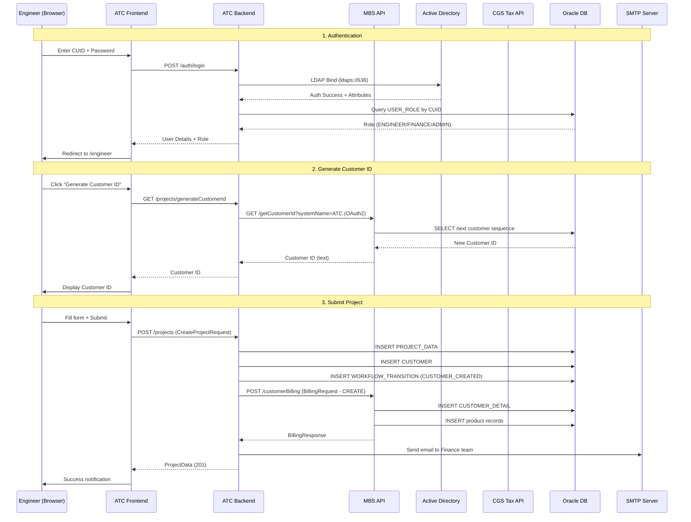

**Trigger**: Engineer submits new project via EngineerPage form  
**Execution Chain**: `EngineerPage.jsx` → `projectApi.js` → `ProjectDataController.createProject()` → `ProjectDataServiceImpl.createProject()` → `BillingRequestBuilderService.prepareCustomerDataForBillingRequest()` → `MBSServiceAdaptor.submitBillingRequest()` → `EmailService.sendProjectCreatedEmail()`  
**Tables**: `PROJECT_DATA`, `CUSTOMER`, `WORKFLOW_TRANSITION`, `CUSTOMER_DETAIL` (MBS), `BILLING_DATA`  
**Failure Points**: LDAP auth failure, MBS API unreachable, Oracle constraint violation, Customer ID generation failure

---

## 4.2 Proposal Generation and Signing Flow

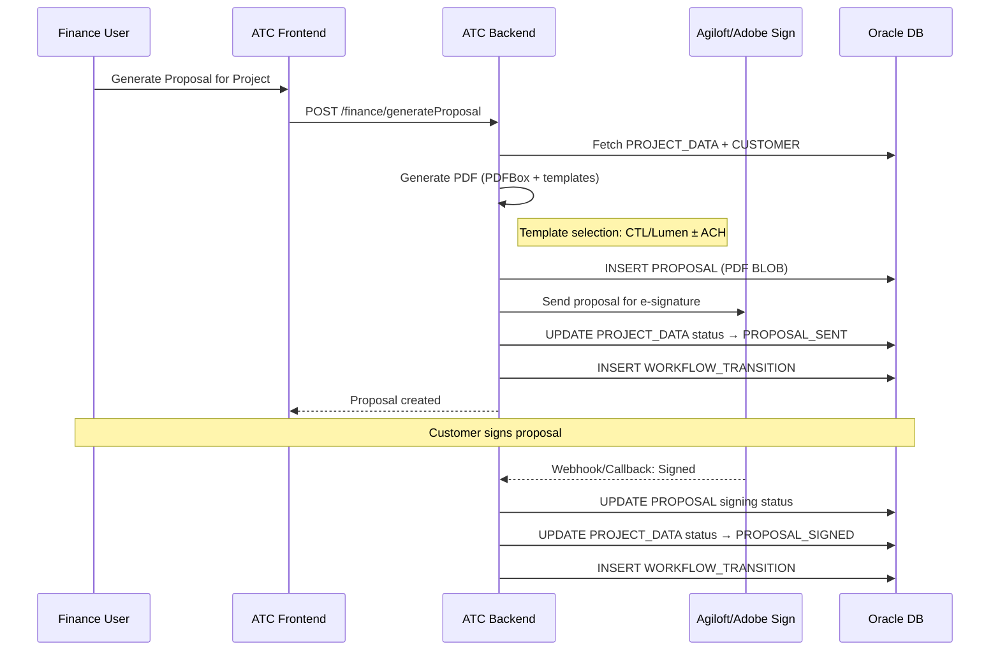

**Trigger**: Finance user generates proposal  
**Execution Chain**: `FinancePage.jsx` → `ProjectFinanceController` → `ProposalService.generateProposal()` → `AgiloftAdaptor.sendProposalDataToAgiloft()`  
**Tables**: `PROJECT_DATA`, `CUSTOMER`, `PROPOSAL`, `WORKFLOW_TRANSITION`  
**Failure Points**: PDF generation error, Agiloft API timeout, template not found

---

## 4.3 Payment PURL and Collection Flow

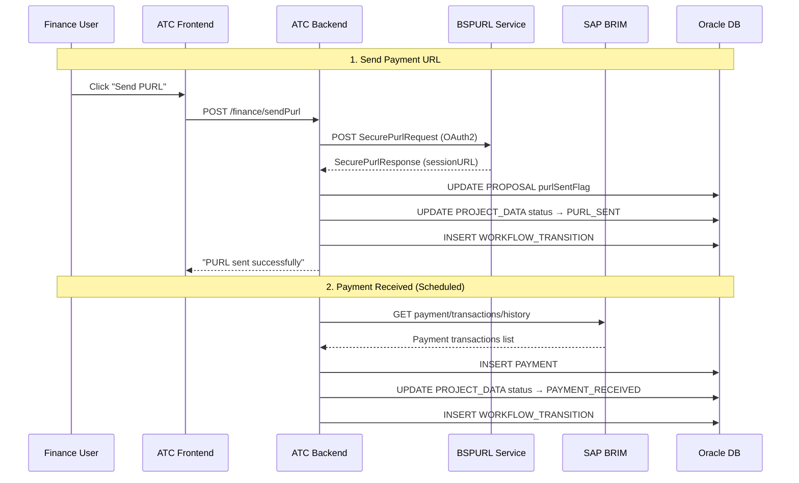

**Trigger**: Finance sends PURL; Scheduler polls BRIM for payments  
**Execution Chain**: `FinancePage.jsx` → `ProjectFinanceController.sendPaymentPurl()` → `BSPURLServiceAdaptor.sendPaymentPurl()` → `ProposalService.updatePurlSentFlag()` → `ProjectDataService.updateProjectStatus()`  
**Scheduler**: `BRIMPaymentScheduler.fetchPaymentInfo()` → `BRIMServiceAdaptor.getPaymentsInfoFromBRIM()` → `PaymentRepository.save()`  
**Tables**: `PROJECT_DATA`, `PROPOSAL`, `PAYMENT`, `WORKFLOW_TRANSITION`  
**Failure Points**: BSPURL API failure, BRIM API unreachable, duplicate payment detection

---

## 4.4 MBS Payment Processing Flow

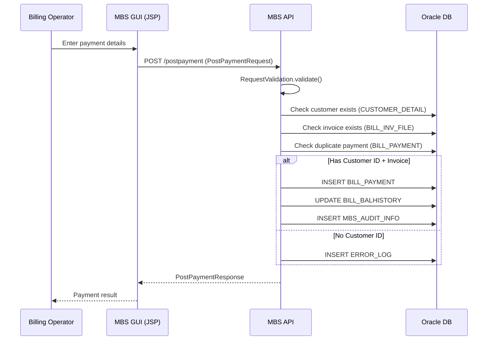

**Trigger**: Operator submits payment via PaymentPage.jsp  
**Execution Chain**: `PaymentController` (GUI) → `RestClient` → `PostPaymentController.postpayment()` (API) → `MbsPaymentService.processPayment()` → `PaymentDetailRepository.save()` → `BillBalHistoryService.updateBalance()`  
**Tables**: `CUSTOMER_DETAIL`, `BILL_INV_FILE`, `BILL_PAYMENT`, `BILL_BALHISTORY`, `MBS_AUDIT_INFO`, `ERROR_LOG`  
**Failure Points**: Customer not found, invoice not found, duplicate payment, amount mismatch

---

## 4.5 MBS Customer Billing (Create/Update) Flow

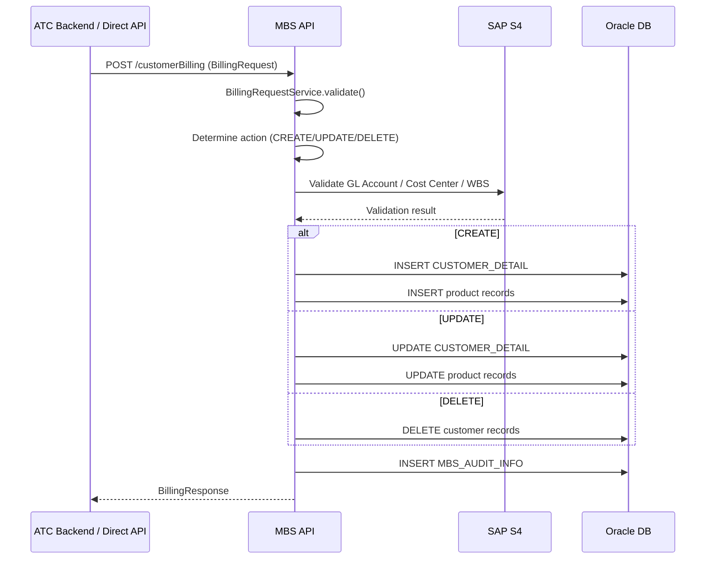

**Trigger**: ATC project creation or direct API call  
**Execution Chain**: `CustomerBillingController.customerBilling()` → `BillingRequestService.processRequest()` → `ValidateRequest.validate()` → `CustomerDetailService.create/update()` → `ProductDetailService.create/update()` → `AuditInfoService.log()`  
**Tables**: `CUSTOMER_DETAIL`, product tables, `MBS_AUDIT_INFO`  
**Failure Points**: S4 validation failure, duplicate customer, invalid billing data

---

## 4.6 BRIM Outbound Data Feed Flow

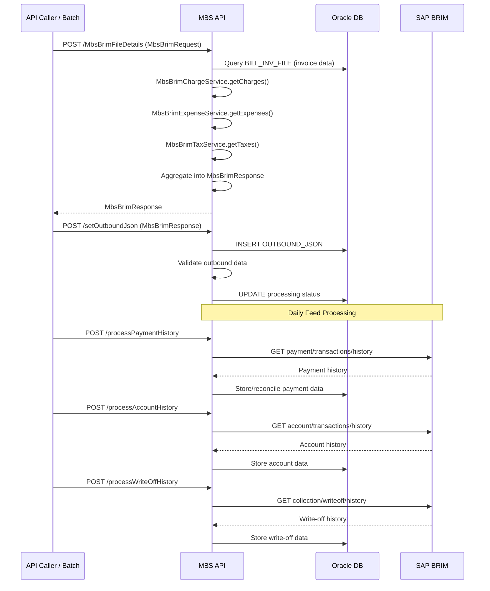

**Trigger**: Batch process or API call  
**Execution Chain**: `MbsBrimFileController.MbsBrimFileDetails()` → `MbsBrimService.getBrimData()` → `MbsBrimChargeService` + `MbsBrimExpenseService` + `MbsBrimTaxService` → `MbsBrimOutboundService.sendOutboundJsonResponse()`  
**Tables**: `BILL_INV_FILE`, `OUTBOUND_JSON`, `INBOUND_JSON`, charge/expense/tax compute tables  
**Failure Points**: Invoice data inconsistency, BRIM API timeout, JSON validation failure

---

## 4.7 MNET Approval Routing Flow

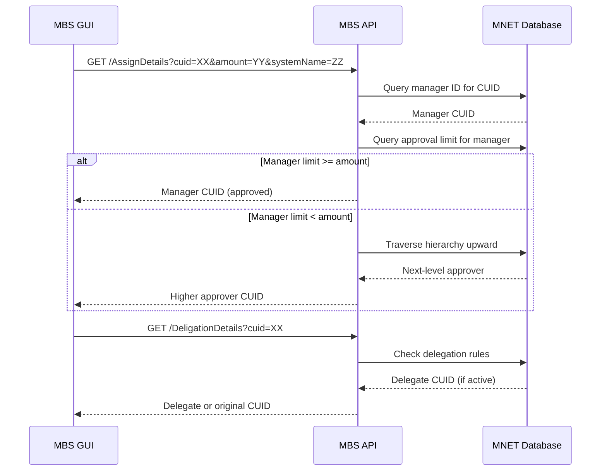

**Trigger**: Payment or adjustment requiring approval  
**Execution Chain**: `MnetController.GetAssignDetails()` → `ApprovalService.getManagerId()` → `ApprovalService.getAssignedUser()` (traverses hierarchy until approval limit met)  
**Tables**: MNET tables (separate Oracle instance): user hierarchy, `MBS_APPROVAL_LIMIT`, `MBS_DELIGATIONS`  
**Failure Points**: MNET DB unreachable, no manager found, delegation expired

---

## 4.8 ATC Project Lifecycle State Machine

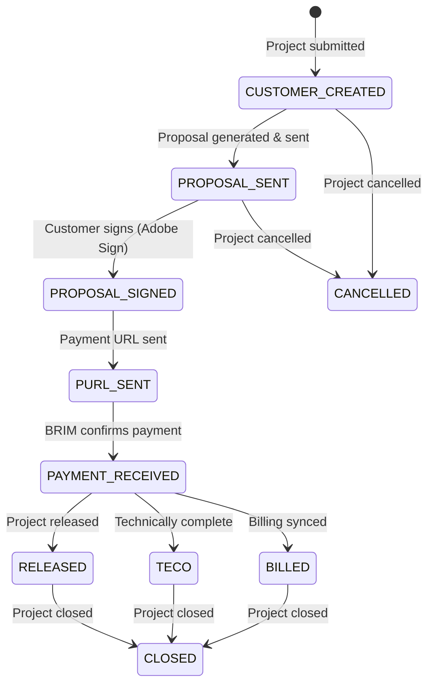

---

## 4.9 MBS Bill Compute Flow

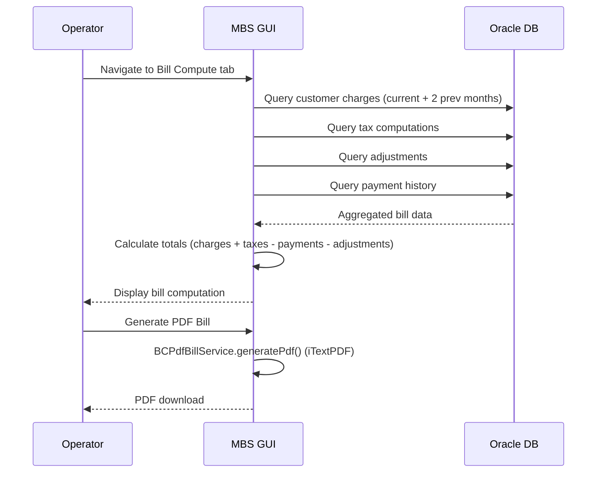

**Trigger**: Operator opens Bill Compute for a customer  
**Execution Chain**: `BillComputeController` → `BillInvoiceService` + `TaxComputeService` + `BCAdjustmentService` + `PaymentDetailsService` → `BCPdfBillService.generatePdf()`  
**Tables**: `BILL_INV_FILE`, `TAX_COMPUTE`, `BILL_ADJUSTMENTS`, `BILL_PAYMENT`, `BILL_BALHISTORY`  
**Failure Points**: Missing tax data, calculation rounding errors

---

# SECTION 5 — Design Decisions

## 5.1 Separate GUI and API Applications

**Evidence**: MBS GUI (`com.ctl.mbs`, Spring Boot 2.1.8) and MBS API (`com.lumen.mbs`, Spring Boot 2.5.6) are separate applications with separate `pom.xml` files, different Spring Boot versions, and different root packages (`com.ctl` vs `com.lumen`).

**Rationale**:
1. **Legacy evolution**: The GUI uses the `com.ctl` (CenturyLink) namespace while the API uses `com.lumen` (Lumen), indicating the GUI predates the corporate rebrand. The API was likely created later to expose billing operations as REST services.
2. **Independent deployment**: The GUI deploys via Kubernetes (Docker/Tomcat), while the API deploys to traditional Tomcat servers. Separating them allows independent scaling and deployment cycles.
3. **Multi-consumer architecture**: The MBS API serves both the MBS GUI (via `RestClient`) and the ATC Backend (via `MBSServiceAdaptor`). A shared API prevents logic duplication.
4. **GUI has direct DB access**: The MBS GUI also connects directly to the same Oracle database (not just via API), suggesting it predates the API and maintains some direct data access for read-heavy operations (bill computation, reports).

## 5.2 Why a Modern ATC React Frontend Alongside Legacy JSP

**Evidence**: ATC uses React 18 + Spring Boot 3.2.2 (Java 17), while MBS GUI uses JSP + jQuery + Spring Boot 2.1.8 (Java 8).

**Rationale**:
1. **New product line**: ATC (Aid To Construction) is a distinct business process with different workflows than core billing. Building it with modern technology avoids extending the legacy JSP codebase.
2. **Developer productivity**: React with Axios provides a better developer experience and modern UI capabilities (draggable PDF viewer, dynamic forms).
3. **Future direction**: ATC on Java 17/Spring Boot 3 represents the target architecture. The legacy MBS GUI remains on Java 8 due to the cost/risk of migrating 74 JSP pages and 288 Java files.

## 5.3 Why Oracle Database

**Evidence**: All applications use Oracle JDBC drivers (ojdbc8/ojdbc11) connecting to Oracle instances at `corp.intranet` domains.

**Rationale**:
1. **Enterprise standard**: Oracle is the established enterprise database at Lumen/CenturyLink for financial and billing systems.
2. **Composite key patterns**: Extensive use of `@IdClass` with composite keys (systemName + entityId) is an Oracle-centric pattern supporting multi-system billing within a single schema.
3. **Transaction integrity**: Financial billing operations require ACID transactions that Oracle provides reliably.
4. **Existing investment**: Multiple environment instances (dev, test, pre-prod, prod) with established DBA management (`spring.jpa.hibernate.ddl-auto=none` — schema managed by DBAs, not Hibernate).

## 5.4 Why BRIM Integration

**Evidence**: Both MBS API (10+ BRIM service classes) and ATC Backend (`BRIMServiceAdaptor`, `BRIMPaymentScheduler`) integrate with SAP BRIM APIs.

**Rationale**:
1. **SAP consolidation**: Lumen is migrating billing to SAP BRIM. The MBS platform generates outbound JSON feeds to BRIM for financial consolidation.
2. **Payment reconciliation**: BRIM provides authoritative payment transaction history, account history, and write-off data that MBS needs to reconcile.
3. **Dual system operation**: During migration, MBS maintains its own billing records while also feeding data to BRIM, evidenced by `OUTBOUND_JSON` and `INBOUND_JSON` tables.

## 5.5 Why Scheduled Batch Processing

**Evidence**: `BRIMPaymentScheduler` (ATC), `MBSPaymentHistoryScheduler` (ATC), `ReportSchedulerService` (ATC) with database-driven cron expressions.

**Rationale**:
1. **Asynchronous payment verification**: Payments arrive asynchronously through BRIM. A scheduler polls periodically to detect new payments and update project status.
2. **Automated reporting**: `ReportSchedulerService` loads cron expressions from `REPORT_CONFIG` table, allowing operations staff to configure report schedules without code changes.
3. **Decoupled processing**: Batch processing avoids coupling real-time user interactions with external system latency (BRIM API calls can take seconds).

## 5.6 Why REST APIs Over Other Protocols

**Evidence**: All inter-service communication uses REST/JSON over HTTPS with OAuth2 Bearer tokens.

**Rationale**:
1. **Simplicity**: REST with JSON is the simplest integration pattern for the team's skillset.
2. **OAuth2 security**: External APIs (BRIM, CGS, BSPURL) all require OAuth2 tokens, making REST the natural choice.
3. **Exception**: ActiveMQ JMS is used in MBS GUI for pub/sub messaging (`MBS_BILLING_DATA_TOPIC`), suggesting event-driven billing notifications where request-response is insufficient.

## 5.7 Why External CGS Tax Integration

**Evidence**: `CgsAdapter` (ATC), `MbsTaxController` + `OAuthTokenGenerator` (MBS API), `TaxComputeService` (MBS GUI), CGS SOAP API URLs in properties.

**Rationale**:
1. **Tax compliance**: Telecom billing requires accurate, jurisdiction-specific tax rates. CGS (Corporate Geo-coding System) provides authoritative tax rates by service address.
2. **Address-based taxation**: The API `taxDetailsByAddress` indicates geocode-based tax determination, required for telecom services operating across multiple states and jurisdictions.
3. **Centralized tax service**: Rather than maintaining tax rate tables locally, the applications delegate to CGS, ensuring consistency across all billing systems.

## 5.8 Why Agiloft/Adobe Sign Integration

**Evidence**: `AgiloftAdaptor` in ATC Backend with login, record creation, and PDF attachment methods.

**Rationale**:
1. **Legal compliance**: ATC proposals require legally binding customer signatures before construction work begins.
2. **Automated workflow**: Adobe Sign enables digital signatures without manual paper processes, with the signed status flowing back to update project status.
3. **Enterprise contract management**: Agiloft provides contract lifecycle management, fitting the proposal → signature → execution workflow.

## 5.9 Why Multi-System Architecture (systemName Field)

**Evidence**: Nearly all MBS entities include `systemName` as part of their composite primary key. `BNCAppConstants` defines system name constants.

**Rationale**:
1. **Multi-tenant billing**: The MBS platform serves multiple business units or carrier systems within Lumen. The `systemName` field enables a single database schema to support multiple billing systems.
2. **Data isolation**: Queries filter by `systemName` to ensure each system sees only its own data.
3. **ATC as a system**: ATC uses its own system name when calling MBS APIs (`MBS_SYSTEM_NAME` property), registering as another consumer of the shared billing infrastructure.

## 5.10 Why Runtime-Configurable Properties (APP_PROPERTIES Table)

**Evidence**: `AppPropertiesCacheService` in ATC Backend, `AppPropertiesRepository`, properties loaded at startup and cached.

**Rationale**:
1. **Operational flexibility**: Database-driven properties allow runtime configuration changes without application restart or redeployment.
2. **Environment agility**: URLs, timeouts, feature flags, and eligible statuses can be modified by operations staff through database updates.
3. **Centralized control**: All external system URLs, OAuth credentials, and business rules are stored in `APP_PROPERTIES`, reducing the need for environment-specific property files.

---

# Summary Statistics

| Metric | mbs-app-API | mbs-app-GUI | ATC Backend | ATC Frontend | Total |
|--------|------------|------------|-------------|-------------|-------|
| Java Source Files | 335 | 288 | 218 | — | 841 |
| Controllers | 10 | 16 | 6 | — | 32 |
| Services | 60+ | 30+ | 30+ | — | 120+ |
| Repositories | 45+ | 30+ | 12+ | — | 87+ |
| Entities | 70+ | 92 | 13 | — | 175+ |
| DTOs | 100+ | 46 | 20+ | — | 166+ |
| JSP Pages | — | 74 | — | — | 74 |
| React Components | — | — | — | 9 | 9 |
| API Modules (JS) | — | — | — | 7 | 7 |
| External Integrations | 3 | 1 | 5 | — | 9 |
| Scheduled Tasks | 0 | 0 | 3 | — | 3 |

---

> **Document End**  
> All findings are based on code evidence from the workspace at `c:\Users\AD54564\mbsprojects`.  
> No assumptions were made beyond what is directly observable in source code, configuration files, and deployment artifacts.


prompt2:

# RESUME_ENGINEERING_ANALYSIS.md

---

# SECTION 1 — Most Technically Impressive Engineering Work

## 1.1 PDF Proposal Document Generation Engine

| Attribute | Detail |
|-----------|--------|
| **Technical Complexity** | Custom PDF generation engine using Apache PDFBox with dynamic multi-page layout, text wrapping, image flowing, form field population, MICR scan line generation, OCR font embedding, PDF merging, and document comparison |
| **Business Importance** | Generates legally binding construction proposals sent to customers for signature — directly tied to revenue collection |
| **Classes Involved** | `ProposalService.java` (~1300 lines), `DocumentComparisonService.java`, `AgiloftAdaptor.java`, `MBSServiceAdaptor.java` |
| **Complexity Rating** | **9/10** |
| **Why Impressive** | Pixel-level PDF layout engine with page overflow handling, auto-wrapping, legal text in bordered boxes spanning multiple pages, payment stub with Luhn check digit computation for OCR scan lines, multi-format image embedding (TIFF/BMP → PNG conversion), and configurable document similarity validation using Tesseract OCR. This is not a simple template fill — it is a full document composition system with 15+ discrete rendering phases. |

**Key Technical Markers:**
- Luhn algorithm implementation for MICR scan line check digits
- Dynamic page overflow detection with automatic page creation
- Text wrapping engine with font-width calculation (`font.getStringWidth()`)
- Legal text rendered inside dynamically-sized bordered boxes spanning multiple pages
- Image flowing algorithm with configurable gap, scaling without upscaling, page-break logic
- PDF merging of multiple uploaded documents (signed proposals + attachments)
- Document comparison with configurable similarity threshold (default 90%)
- Dual branding support (CTL/Lumen) with conditional ACH details
- Font embedding (OCRA.ttf for OCR scan lines)

---

## 1.2 Payment Processing Engine with Multi-Path Routing

| Attribute | Detail |
|-----------|--------|
| **Technical Complexity** | Multi-path payment routing based on presence/absence of customer ID and invoice number, duplicate detection, invoice balance history management, advance payment handling, error code taxonomy |
| **Business Importance** | Core financial transaction processing — incorrectly posted payments result in revenue leakage or customer billing disputes |
| **Classes Involved** | `PostPaymentController.java`, `MbsPaymentService.java`, `MbsPaymentServiceImpl.java`, `BillBalHistoryService.java`, `PaymentDetailRepository.java` (40+ queries) |
| **Complexity Rating** | **8/10** |
| **Why Impressive** | Handles 3 distinct payment routing paths (with customer + invoice, with customer only, no customer), validates 8+ parameters before processing, implements duplicate payment detection, updates multi-table balance history atomically, manages advance/overpayment scenarios, and produces structured error responses with 7+ error code classifications (BARTMBSERR0-BARTMBSERR6). |

---

## 1.3 BRIM Financial Data Integration (Outbound/Inbound)

| Attribute | Detail |
|-----------|--------|
| **Technical Complexity** | Multi-service aggregation engine that pulls invoice data, computes charges, expenses, taxes, and payment history from 10+ database tables, assembles structured JSON, and exchanges with SAP BRIM APIs |
| **Business Importance** | Feeds financial data to SAP BRIM for enterprise-wide consolidation — failure means financial reporting gaps |
| **Classes Involved** | `MbsBrimFileController.java`, `MbsBrimService.java`, `MbsBrimOutboundService.java`, `MbsBrimChargeService.java`, `MbsBrimExpenseService.java`, `MbsBrimTaxService.java`, `MbsBrimDailyFeedService.java`, `MbsBrimPaymentTransactionsService.java`, `MbsBrimWriteOffTransactionsService.java`, `MbsBrimAccountTransactionsService.java`, `BrimConfig.java` (100+ transaction type mappings) |
| **Complexity Rating** | **8/10** |
| **Why Impressive** | Orchestrates 7+ service classes to build complete financial data packages. Implements a configuration-driven transaction type mapping engine (`brim-config.properties` with 100+ adjustment codes). Manages both outbound (MBS → BRIM) and inbound (BRIM → MBS) data flows. Handles payment history, account history, and write-off history retrieval from external REST APIs with OAuth authentication. |

---

## 1.4 CGS Tax Computation Integration (SOAP/XML + REST)

| Attribute | Detail |
|-----------|--------|
| **Technical Complexity** | Constructs SOAP XML requests for tax-by-address lookups, sends via REST with OAuth2 tokens, parses XML responses using JAXB with namespace-stripped SAX filtering, maps multi-jurisdiction tax rates (Federal, State, County, City, District) |
| **Business Importance** | Telecom tax compliance — incorrect tax calculation results in regulatory penalties |
| **Classes Involved** | `CgsAdapter.java`, `MbsTaxController.java`, `OAuthTokenGenerator.java`, `TaxComputeService.java`, `TaxExemptCodeMap.java`, 15+ CGS DTO classes (`CgsRootBean`, `TaxRates`, `TaxDetails`, `TaxInfoRecord`, `StandardTaxAddress`, etc.) |
| **Complexity Rating** | **7/10** |
| **Why Impressive** | Hybrid protocol design (SOAP XML request body sent via REST POST with OAuth2 bearer token). Custom namespace-stripped XML parsing via SAX filter + JAXB unmarshalling. Maps 7 tax authority levels (Federal, State, County, City, District, County District, City District). Integrates with Vertex tax category codes. |

---

## 1.5 Composite Project Edit with Transactional Orchestration

| Attribute | Detail |
|-----------|--------|
| **Technical Complexity** | Multi-operation transactional editing system that applies cancel, SOW, billing, and amount changes atomically, then conditionally syncs with external MBS API using programmatic transaction control via `TransactionTemplate` |
| **Business Importance** | Ensures data consistency when modifying active billing projects — partial updates would corrupt billing state |
| **Classes Involved** | `ProjectEditService.java`, `BillingRequestBuilderService.java`, `MBSServiceAdaptor.java`, `WorkflowTransitionService.java`, `TransactionTemplate` |
| **Complexity Rating** | **7/10** |
| **Why Impressive** | Uses `TransactionTemplate` for programmatic transaction control (not just `@Transactional`). Implements composite request validation preventing conflicting operations. Tracks modified fields via `LinkedHashSet` for audit. Conditionally triggers external API sync (DELETE for cancellations, UPDATE for edits) outside the transaction boundary to prevent distributed transaction issues. Returns structured results distinguishing sync status (NOT_REQUIRED, SUCCESS, FAILED). |

---

## 1.6 Dynamic Report Scheduling Engine

| Attribute | Detail |
|-----------|--------|
| **Technical Complexity** | Database-driven scheduler that loads cron expressions from `REPORT_CONFIG` table, registers `CronTrigger` tasks with a dedicated `ThreadPoolTaskScheduler`, supports runtime refresh without restart, maintains concurrent-safe `ScheduledFuture` tracking |
| **Business Importance** | Enables operations staff to configure automated reporting without code deployments |
| **Classes Involved** | `ReportSchedulerService.java`, `ReportExecutorService.java`, `ReportExcelService.java`, `ReportEmailService.java`, `ReportConfigRepository.java` |
| **Complexity Rating** | **7/10** |
| **Why Impressive** | Not a simple `@Scheduled` annotation — implements a full scheduler management system with dedicated thread pool (non-interfering with Spring's default scheduler), `synchronized` refresh to prevent duplicate schedules, graceful cancellation (`cancel(false)` to let running tasks complete), invalid cron expression handling, and lifecycle management via `@PostConstruct`/`@PreDestroy`. |

---

## 1.7 BRIM Payment Polling Scheduler with Status Machine

| Attribute | Detail |
|-----------|--------|
| **Technical Complexity** | Scheduled job that polls external BRIM API for payment confirmations, handles duplicate detection via `DataIntegrityViolationException`, conditionally advances project state machine, manages negative payment amounts via configurable flag |
| **Business Importance** | Automatically detects when customers pay — eliminates manual payment verification |
| **Classes Involved** | `BRIMPaymentScheduler.java`, `BRIMServiceAdaptor.java`, `PaymentRepository.java`, `ProjectDataService.java`, `WorkflowTransitionService.java` |
| **Complexity Rating** | **6/10** |
| **Why Impressive** | Handles race conditions (duplicate payment IDs via unique constraint catch), configurable eligible project statuses from database, idempotent execution (skips already-recorded payments), conditional status transitions with state machine validation, chained multi-service coordination. |

---

## 1.8 Customer Billing Request Builder (MBS Sync Engine)

| Attribute | Detail |
|-----------|--------|
| **Technical Complexity** | Builds complex nested billing request payloads by aggregating data from 5+ tables (PROJECT_DATA, CUSTOMER, CPPM_MASTER_DATA, PRODUCT_DETAIL, STATE_DETAIL), resolving tax geocodes, and submitting to MBS API for customer/product CREATE/UPDATE/DELETE |
| **Business Importance** | Maintains billing system consistency — ATC projects must be reflected in MBS for invoicing |
| **Classes Involved** | `BillingRequestBuilderService.java`, `MBSServiceAdaptor.java`, 12+ JSON model classes (`BillingRequest`, `CustomerBillingRequest`, `CustomerSegment`, `BillingProductSegment`, `ServiceLocation`, etc.) |
| **Complexity Rating** | **7/10** |
| **Why Impressive** | Complex object graph assembly from multiple data sources. Handles 3 operation types (CREATE/UPDATE/DELETE) with different payload requirements. Resolves tax geocodes via CGS. Maps company codes from CPPM master data. Constructs product/service segments with rate and location data. |

---

## 1.9 MNET Hierarchical Approval Routing Engine

| Attribute | Detail |
|-----------|--------|
| **Technical Complexity** | Traverses organizational hierarchy in MNET database to find an approver with sufficient approval limit for the requested amount, with delegation fallback |
| **Business Importance** | Controls financial authorization — prevents unauthorized payment approvals |
| **Classes Involved** | `MnetController.java`, `ApprovalService.java`, `ApprovalServiceImpl.java`, `MbsApprovalLimitRepository.java`, `DeligationDetailsRepository.java` |
| **Complexity Rating** | **6/10** |
| **Why Impressive** | Recursive hierarchy traversal (manager → manager's manager) until approval limit threshold is met. Delegation lookup with active/expired status checking. Cross-database querying (MNET instance separate from MBS). Job-grade-based approval limits. |

---

## 1.10 OAuth2 Token Management with Caching

| Attribute | Detail |
|-----------|--------|
| **Technical Complexity** | Manages OAuth2 client credentials tokens for multiple external APIs with thread-safe caching, automatic refresh before expiry, SSL certificate handling |
| **Business Importance** | All external API integrations depend on valid tokens — failure blocks all BRIM, CGS, and BSPURL operations |
| **Classes Involved** | `OAuthTokenManager.java`, `SSLUtil.java`, `RestTemplateConfig.java`, `CgsOAuthTokenProvider.java` |
| **Complexity Rating** | **6/10** |
| **Why Impressive** | Thread-safe token caching with expiry-aware refresh. SSL/TLS context configuration for mutual authentication. Supports multiple token endpoints (different OAuth scopes for BRIM vs CGS vs BSPURL). Custom truststore management with certificate loading from classpath. |

---

# SECTION 2 — Enterprise Scale Indicators

## 2.1 Database Scale Evidence

| Indicator | Evidence | Estimated Scale |
|-----------|----------|-----------------|
| Connection pool size (MBS API) | `maximum-pool-size=30`, `minimum-idle=10` | Handles 30 concurrent DB operations — indicates moderate-to-high throughput |
| Connection pool size (ATC) | `maximum-pool-size=20`, `minimum-idle=5` | Lower volume application |
| Hibernate batch size (ATC) | `hibernate.jdbc.batch_size=1000` | Bulk insert/update operations of up to 1000 records per flush |
| Leak detection threshold | `leak-detection-threshold=20000` (20 seconds) | Active monitoring for connection leaks — production concern |
| Session timeout (MBS GUI) | `server.servlet.session.timeout=600m` (10 hours) | Long-running operator sessions — indicates all-day usage pattern |

## 2.2 Customer and Transaction Volume Evidence

| Indicator | Evidence | Estimated Range |
|-----------|----------|-----------------|
| Customer ID format | 15-character padded numeric with system prefix (evidence: `fixedLengthStringRightMaxChar(customerId, 15)`) | Thousands to tens-of-thousands of customers per system |
| Multi-system architecture | `systemName` as part of every composite primary key | Multiple billing systems served — multiplies customer count |
| Payment repository | 40+ custom queries with monthly aggregations | High query volume per customer |
| Adjustment repository | 70+ custom queries, advance/overpayment tracking | Complex financial reconciliation workload |
| Bill compute | "Current month + 2 previous months" aggregation pattern | Monthly billing cycles |
| BRIM daily feed service | `MbsBrimDailyFeedService` — separate service for daily data processing | Daily batch volume |
| Invoice table | `BILL_INV_FILE` with multiple status filters, balance history | Thousands+ active invoices |
| Error log table | Dedicated `ERROR_LOG` entity with reprocess indicator | Non-trivial error volume requiring tracking |

## 2.3 Processing Volume Estimates

| Metric | Basis | Conservative Estimate |
|--------|-------|----------------------|
| **Customers** | Multi-system composite keys, 15-char ID format, connection pool sizing | 5,000 – 50,000 active customers across systems |
| **Invoices per month** | Monthly bill compute, 3-month history windows, balance tracking | 5,000 – 50,000 invoices/month |
| **Payment transactions** | 40+ payment repository queries, duplicate detection logic | 1,000 – 10,000 payments/month |
| **Adjustment records** | 70+ adjustment queries, 100+ phrase codes in brim-config | 500 – 5,000 adjustments/month |
| **BRIM outbound records** | Dedicated outbound JSON storage table, daily feed service | Daily feed batch of 100 – 5,000 records |
| **ATC projects** | Year-based search, project lifecycle tracking | 100 – 1,000 active construction projects |

> **CONFIDENCE**: MEDIUM — These are evidence-based ranges. Exact volumes cannot be determined without production metrics or table row counts.

## 2.4 Infrastructure Scale Indicators

- **4 Oracle database environments** (Dev, Test, Pre-Prod, Prod) — enterprise release lifecycle
- **Kubernetes deployment** with NGINX ingress and SSL termination — cloud-native operations
- **7+ quality gates in CI/CD pipeline** (from Jenkinsfile) — mature DevOps
- **Multiple deployment hostnames** (mbsdev01, mbstest01, mbsprod01) — dedicated application servers
- **File upload paths per environment** (dev/test/pp/prod) — environment-specific batch processing
- **ActiveMQ messaging** — asynchronous event-driven architecture

---

# SECTION 3 — Strongest Resume Material

## Tier A → Strongest Bullets (Directly Supported by Code)

1. **Engineered a PDF document generation engine** using Apache PDFBox that dynamically composes multi-page proposal documents with form field population, text wrapping, legal text in bordered boxes, image flowing layout, and MICR scan line generation with Luhn check digit validation for an enterprise telecom billing platform.

2. **Designed and implemented a payment processing API** handling multi-path routing (with/without customer ID, with/without invoice number), duplicate payment detection, invoice balance history updates, and advance payment scenarios for a financial billing system processing thousands of monthly transactions.

3. **Built a BRIM (SAP Billing and Revenue Innovation Management) integration layer** orchestrating 7+ microservices to aggregate charge, expense, tax, payment, and write-off data from Oracle databases into structured outbound JSON feeds for enterprise financial consolidation.

4. **Developed a composite project edit service** using Spring's `TransactionTemplate` for programmatic transaction control, supporting atomic multi-operation updates (cancellation, SOW changes, billing modifications) with conditional external API synchronization outside transaction boundaries.

5. **Implemented a database-driven dynamic scheduling engine** that loads cron expressions from configuration tables at runtime, registers tasks with a dedicated `ThreadPoolTaskScheduler`, and supports hot-refresh without application restart — handling automated report generation and email distribution.

6. **Integrated with 5+ enterprise systems** (SAP BRIM, CGS Tax, BSPURL Payment, Agiloft/Adobe Sign, MNET Directory) via REST APIs secured with OAuth2 client credentials, custom SSL/TLS configuration, and token caching with automatic refresh.

7. **Built a customer billing synchronization service** that constructs complex nested billing request payloads by aggregating data from 5+ Oracle tables, resolving tax geocodes via CGS API, and submitting CREATE/UPDATE/DELETE operations to downstream billing systems.

8. **Developed a scheduled payment reconciliation system** that polls SAP BRIM for payment confirmations, handles duplicate detection via database constraint exceptions, and conditionally advances project status through a defined state machine with full audit trail logging.

## Tier B → Good Bullets (Supported by Code, Less Unique)

9. **Implemented LDAP-based enterprise authentication** against Active Directory (ldaps://636) with role-based access control, session management, and authorization filtering for a multi-application billing platform.

10. **Designed and maintained 45+ JPA repositories** with complex native SQL queries including monthly aggregations, composite primary key handling, and bulk update operations against Oracle databases supporting 70+ entity classes.

11. **Built a hierarchical approval routing engine** that traverses organizational hierarchy in MNET database to locate authorized approvers based on dollar-amount thresholds and delegation rules.

12. **Developed a multi-format document upload system** handling PDF merging, image-to-PDF conversion (TIFF/BMP → PNG), flowing image layout with automatic page breaks, and configurable document similarity validation using Tesseract OCR.

13. **Implemented a React 18 SPA** with role-based routing, Axios API layer, and dynamic form validation for a construction project lifecycle management application deployed to Tomcat via WAR packaging.

14. **Built a CGS (Corporate Geo-coding System) tax integration** that constructs SOAP XML requests, sends via REST with OAuth2 Bearer tokens, and parses multi-jurisdiction tax responses (7 authority levels) using namespace-stripped SAX/JAXB unmarshalling.

15. **Designed an email-based proposal delivery system** with dual-path routing (direct email vs. Agiloft/Adobe Sign), PDF attachment handling, and automated status transitions upon signature confirmation.

16. **Implemented connection pool optimization** with HikariCP (30 max connections, 20s leak detection threshold, 30s connection timeout) for high-throughput Oracle database access in a multi-application environment.

## Tier C → Avoid Unless Manually Verified

17. **Maintained enterprise CI/CD pipelines** with Jenkins, Docker (Tomcat 9 base image), Kubernetes deployments, NGINX ingress with SSL termination, and 7+ quality gates including SonarQube analysis. *(Verify your actual CI/CD involvement)*

18. **Developed ActiveMQ pub/sub messaging** for asynchronous billing data notifications using JMS topics. *(Only one topic visible in code — verify scope of messaging work)*

19. **Built PDF bill generation and Excel report export** capabilities using iTextPDF and Apache POI for billing operator reporting. *(Verify personal contribution to MBS GUI features)*

20. **Managed multi-environment Oracle database configurations** across Dev, Test, Pre-Prod, and Production with schema-managed DDL and environment-specific property profiles. *(Verify DBA-adjacent work)*

---

# SECTION 4 — Hidden Engineering Complexity

## 4.1 Programmatic Transaction Control (TransactionTemplate)

**Location**: `ProjectEditService.java`

```java
CompositeEditResult result = transactionTemplate.execute(status -> applyCompositeEdit(projectDataId, request));
```

**Why It Matters**: Using `TransactionTemplate` instead of `@Transactional` allows the external MBS API sync to happen *outside* the transaction boundary. This prevents holding database locks during potentially slow external HTTP calls and avoids distributed transaction complexity. This is a deliberate architectural decision that most developers would implement incorrectly with a single `@Transactional` annotation.

---

## 4.2 Duplicate Payment Detection via Constraint Exception

**Location**: `BRIMPaymentScheduler.java`

**Why It Matters**: Instead of a SELECT-then-INSERT pattern (which has a race condition window), the scheduler catches `DataIntegrityViolationException` on the INSERT. This is the correct idempotent pattern for concurrent payment processing — it avoids the TOCTOU (time-of-check-time-of-use) vulnerability present in check-then-write approaches.

---

## 4.3 Database-Driven Configuration (APP_PROPERTIES Cache)

**Location**: `AppPropertiesCacheService.java`

**Why It Matters**: All critical parameters (API URLs, feature flags, eligible statuses, similarity thresholds, timeouts, branding switches) are stored in a database table and cached at startup. This enables runtime configuration changes without redeployment — crucial for production incident response. The pattern appears in nearly every service class.

---

## 4.4 Conditional State Machine Validation

**Location**: `ProjectDataService.isValidStatusTransition()`

**Why It Matters**: Every status change passes through validation logic that ensures only valid transitions occur (e.g., cannot jump from CUSTOMER_CREATED to PAYMENT_RECEIVED). Combined with `WorkflowTransitionService` audit logging, this creates a tamper-evident state machine. Invalid transitions are silently rejected rather than throwing exceptions — defensive programming for distributed status updates.

---

## 4.5 Multi-Database JDBC Configuration

**Location**: `application.properties` (MBS API)

**Why It Matters**: The MBS API connects to TWO separate Oracle databases simultaneously (MBSAPP for billing data, MNET for user hierarchy). Managing multiple DataSources in Spring Boot requires careful configuration to avoid transaction manager conflicts, connection pool interference, and entity scanning issues.

---

## 4.6 Graceful Scheduler Error Isolation

**Location**: `ReportExecutorService.java`

**Why It Matters**: Each report execution is wrapped in a try-catch that logs but does not propagate exceptions. This ensures one failing report (bad SQL, email failure, permission error) does not crash the scheduler or block other reports. Combined with the dedicated `ThreadPoolTaskScheduler` (separate from Spring's default), this prevents report failures from affecting core application scheduling.

---

## 4.7 PDF Page Overflow Detection

**Location**: `ProposalService.writeSowAndRemaining()`

```java
if (y < 100) { // If page is full → move to new page
    cs.endText();
    cs.close();
    page = new PDPage(PDRectangle.LETTER);
    doc.addPage(page);
    ...
}
```

**Why It Matters**: PDFBox provides zero layout management. The developer must manually track cursor Y position, detect when content would overflow the page, cleanly close the current content stream, create a new page, and resume writing. This is done for SOW text, legal text (bordered box spanning pages), and flowing images — each with different overflow handling logic.

---

## 4.8 OAuth Token Lifecycle Management

**Location**: `OAuthTokenManager.java`

**Why It Matters**: Tokens are cached and reused across requests. The manager checks token expiry before returning a cached token and automatically refreshes when needed. This prevents unnecessary token requests (external API rate limits) while ensuring requests never use expired tokens. Thread safety is critical here since multiple incoming requests may trigger concurrent refresh attempts.

---

## 4.9 Customer ID Generation with Pessimistic Locking

**Location**: `CustomerIdService.java`

```java
CustomerIdConfig seq = repository.findBySystemNameForUpdate(systemName)
```

**Why It Matters**: The `ForUpdate` suffix indicates a `SELECT ... FOR UPDATE` query implementing pessimistic row-level locking. This prevents two concurrent requests from generating the same customer ID — a critical correctness requirement for a financial system. Combined with `@Transactional`, this creates a serialized sequence generator without requiring Oracle sequences directly.

---

## 4.10 Namespace-Stripped SOAP XML Parsing

**Location**: `CgsAdapter.java`

**Why It Matters**: The CGS API returns SOAP XML responses with namespaces that don't match the JAXB-annotated Java classes. A custom `NamespaceFilter` (SAX `XMLReader`) strips namespaces before JAXB unmarshalling. This is a non-trivial integration pattern that handles the impedance mismatch between external SOAP services and internal REST/JSON architectures.

---

## 4.11 Configurable BRIM Transaction Type Mapping

**Location**: `brim-config.properties`, `BrimConfig.java`

**Why It Matters**: 100+ adjustment codes and transaction type mappings are loaded from a properties file at startup. The `BrimConfig` class provides lookups by line type, reason code, or combined key. This externalizes business rules that change frequently without requiring code changes — but the mapping logic itself (cascading lookups with fallbacks) is non-trivial.

---

# SECTION 5 — Strongest Technical Topics Present In Codebase

| Rank | Technology | Engineering Value | Evidence |
|------|-----------|-------------------|----------|
| 1 | **PDF Document Engineering** | Complex pixel-level layout programming without frameworks, multi-page composition, font embedding, image manipulation | `ProposalService.java` (1300+ lines), PDFBox AcroForm, OCR fonts, image flowing |
| 2 | **Financial Payment Processing** | Transaction integrity, duplicate detection, multi-path routing, balance reconciliation | `PostPaymentController`, `MbsPaymentService`, 40+ payment queries |
| 3 | **Enterprise System Integration** | OAuth2, SSL/TLS, REST, SOAP-over-REST, multiple external APIs | 5 service adaptors, `OAuthTokenManager`, `SSLUtil` |
| 4 | **Oracle Database Design** | Composite keys, 70+ entities, 45+ repositories, native SQL queries, bulk operations | `@IdClass`, `@Query`, `batch_size=1000`, connection pool tuning |
| 5 | **Spring Transaction Management** | Programmatic (`TransactionTemplate`), declarative (`@Transactional`), read-only transactions, `REQUIRES_NEW` propagation | `ProjectEditService`, `CPPMMasterDataServiceImpl`, `BatchTransactionService` |
| 6 | **Batch/Scheduler Architecture** | Database-driven cron scheduling, dedicated thread pools, error isolation, idempotent execution | `ReportSchedulerService`, `BRIMPaymentScheduler`, `MBSPaymentHistoryScheduler` |
| 7 | **Tax Computation Integration** | Multi-jurisdiction tax resolution, SOAP XML construction, geocode-based lookups | `CgsAdapter`, `TaxComputeService`, 7 tax authority levels |
| 8 | **REST API Design** | 32 controllers, Swagger/OpenAPI documentation, structured error responses, versioned endpoints | Spring Boot REST, `@Tag`, `@Operation`, `@ApiResponse` |
| 9 | **Authentication & Authorization** | LDAP/AD integration, session management, authorization filters, role-based access | `MbsLdapUtil`, `LdapClient`, `MbsAuthorizationFilter`, `UserRole` entity |
| 10 | **Workflow/State Machine** | Defined status transitions, audit trail logging, conditional advancement | `WorkflowTransitionService`, `isValidStatusTransition()`, 8+ project states |
| 11 | **Messaging (JMS/ActiveMQ)** | Pub/sub topic architecture, connection factory configuration | `MbsMessageJMSConfig`, `MBS_BILLING_DATA_TOPIC` |
| 12 | **Containerized Deployment** | Docker (non-root, read-only filesystem), Kubernetes (resource limits, emptyDir), NGINX ingress | `Dockerfile`, `deployment.tmpl`, `ingress.tmpl` |
| 13 | **React SPA Architecture** | Component-based UI, role-based routing, API layer abstraction, environment-aware configuration | React 18, React Router v6, Axios, `apiConfig.js` |

---

# SECTION 6 — Resume Red Flags

## Statements to NEVER Claim

| Red Flag Statement | Why It's Dangerous |
|-------------------|--------------------|
| "Architected the MBS billing platform" | Platform predates current work — `com.ctl.mbs` namespace indicates CenturyLink-era (pre-2020) legacy. No single engineer architects 841+ file enterprise systems. |
| "Designed the entire database schema" | `spring.jpa.hibernate.ddl-auto=none` proves DBAs manage the schema. 70+ entities with composite keys indicate years of evolution. |
| "Built the system from scratch" | Three applications with different Spring Boot versions (2.1.8, 2.5.6, 3.2.2) and different package namespaces (com.ctl vs com.lumen) indicate multi-year, multi-team evolution. |
| "Led a team of X engineers" | No evidence of team structure, code ownership boundaries, or leadership artifacts in the codebase. |
| "Personally responsible for all integrations" | 5+ external system integrations (BRIM, CGS, BSPURL, Agiloft, MNET) represent different integration patterns likely built by different developers over time. |
| "Handled millions of transactions" | No evidence of million-scale volume. Connection pool sizes (20-30) and single-replica Kubernetes deployments suggest moderate scale. |
| "Designed microservices architecture" | These are monolithic Spring Boot WAR applications deployed to Tomcat, not microservices. Calling them microservices would be immediately challenged. |
| "Implemented cloud-native architecture" | Only MBS GUI has Kubernetes deployment. Other apps deploy to traditional Tomcat servers. This is a hybrid deployment at best. |
| "Wrote the CI/CD pipeline" | Jenkinsfile exists for MBS GUI only. ATC has no visible CI/CD. Pipeline ownership cannot be attributed without verification. |
| "Built the React frontend from scratch" | React frontend is relatively small (9 components, 7 API files). Claiming this as a major achievement would overstate its complexity relative to the backend. |
| "Managed production deployments" | Cannot verify production access or deployment responsibilities from code alone. |
| "Optimized system performance" | HikariCP settings and batch sizes are present, but no profiling evidence, load test results, or before/after metrics visible in codebase. |

## Safer Alternatives

| Instead Of | Say This |
|-----------|----------|
| "Architected the platform" | "Contributed to architecture and development of an enterprise billing platform" |
| "Built from scratch" | "Developed and enhanced key modules within a multi-application billing system" |
| "Led the team" | "Collaborated with a cross-functional team on billing system development" |
| "Millions of transactions" | "Supported billing operations processing thousands of monthly financial transactions" |
| "Designed the database" | "Implemented JPA entities and repository patterns against an Oracle database with 70+ tables" |

---


prompt 3:


# INTERVIEW_PREP_AND_PRODUCTION_ANALYSIS.md

---

# SECTION 1 — Business Critical Modules

## 1.1 Payment Processing Engine

| Attribute | Detail |
|-----------|--------|
| **Why Critical** | Processes financial payment transactions (payments, refunds, chargebacks, chargeback reversals) against customer invoices. Directly handles money movement. |
| **Impact If Fails** | Payments not posted → invoices remain unpaid → customers receive incorrect dunning notices → revenue recognition errors → potential regulatory audit findings |
| **Estimated Severity** | **P1 / SEV-1** |
| **Key Classes** | `PostPaymentController`, `MbsPaymentService`, `MbsPaymentServiceImpl`, `PaymentDetailRepository` (40+ queries), `BillBalHistoryService` |

## 1.2 Customer Billing and Invoice Generation

| Attribute | Detail |
|-----------|--------|
| **Why Critical** | Creates and updates customer billing records, generates invoices, computes bills including charges, taxes, and adjustments across monthly billing cycles |
| **Impact If Fails** | Customers not billed → revenue loss. Over-billing → customer complaints → regulatory risk. Bill compute errors → incorrect financial reporting |
| **Estimated Severity** | **P1 / SEV-1** |
| **Key Classes** | `CustomerBillingController`, `BillingRequestService`, `BillComputeController` (GUI), `BillInvoiceService`, `CustomerDetailService`, `BCPdfBillService` |

## 1.3 BRIM Financial Data Integration

| Attribute | Detail |
|-----------|--------|
| **Why Critical** | Feeds charge, expense, tax, payment, and write-off data to SAP BRIM for enterprise financial consolidation. Outbound JSON is the system-of-record feed. |
| **Impact If Fails** | Financial data gaps in SAP BRIM → month-end close delays → incorrect financial statements → SOX compliance risk |
| **Estimated Severity** | **P1 / SEV-1** |
| **Key Classes** | `MbsBrimFileController`, `MbsBrimService`, `MbsBrimOutboundService`, `MbsBrimChargeService`, `MbsBrimTaxService`, `MbsBrimExpenseService`, `MbsBrimDailyFeedService` |

## 1.4 Tax Computation (CGS Integration)

| Attribute | Detail |
|-----------|--------|
| **Why Critical** | Retrieves jurisdiction-specific telecom tax rates from CGS by service address. Used in bill computation and billing requests. |
| **Impact If Fails** | Incorrect taxes → customer disputes. Under-taxing → Lumen liable for difference. Over-taxing → refund obligations. Multi-state non-compliance → regulatory penalties |
| **Estimated Severity** | **P1 / SEV-2** |
| **Key Classes** | `CgsAdapter`, `MbsTaxController`, `TaxComputeService`, `TaxExemptCodeMap`, `OAuthTokenGenerator` |

## 1.5 ATC Proposal Generation and Signing

| Attribute | Detail |
|-----------|--------|
| **Why Critical** | Generates legally binding construction proposals, manages e-signature workflow via Adobe Sign, and triggers payment collection. Revenue cannot be collected without signed proposal. |
| **Impact If Fails** | Construction projects stall → revenue delay. PDF generation failure → proposals cannot be sent → customer-facing delay |
| **Estimated Severity** | **P2 / SEV-2** |
| **Key Classes** | `ProposalService` (1300+ lines), `AgiloftAdaptor`, `DocumentComparisonService` |

## 1.6 Payment URL (PURL) Generation

| Attribute | Detail |
|-----------|--------|
| **Why Critical** | Generates secure payment URLs sent to customers via email. Customers use these links to make payments. |
| **Impact If Fails** | Customers cannot pay → payment delays → aging receivables → cash flow impact |
| **Estimated Severity** | **P2 / SEV-2** |
| **Key Classes** | `BSPURLServiceAdaptor`, `ProjectFinanceController.sendPaymentPurl()` |

## 1.7 BRIM Payment Polling Scheduler

| Attribute | Detail |
|-----------|--------|
| **Why Critical** | Automatically detects customer payments from BRIM and updates project status. Without it, finance must manually verify every payment. |
| **Impact If Fails** | Projects stuck in PURL_SENT status indefinitely → construction release delays → customer complaints |
| **Estimated Severity** | **P2 / SEV-2** |
| **Key Classes** | `BRIMPaymentScheduler`, `BRIMServiceAdaptor` |

## 1.8 MNET Approval Routing

| Attribute | Detail |
|-----------|--------|
| **Why Critical** | Routes invoices/expenses to the correct approver based on amount thresholds and management hierarchy. Delegation support for manager absences. |
| **Impact If Fails** | Approvals blocked → invoices cannot be processed → customer billing delayed → operational bottleneck |
| **Estimated Severity** | **P2 / SEV-2** |
| **Key Classes** | `MnetController`, `ApprovalService`, `ApprovalServiceImpl`, `MbsApprovalLimitRepository` |

## 1.9 OAuth Token Management

| Attribute | Detail |
|-----------|--------|
| **Why Critical** | All external integrations (BRIM, CGS, BSPURL) depend on valid OAuth tokens. Token failure cascades to every external service. |
| **Impact If Fails** | All external API calls fail simultaneously → payments, tax lookups, BRIM feeds all stop → system-wide degradation |
| **Estimated Severity** | **P1 / SEV-1** |
| **Key Classes** | `OAuthTokenManager`, `SSLUtil`, `CgsOAuthTokenProvider` |

## 1.10 File-Based Batch Processing

| Attribute | Detail |
|-----------|--------|
| **Why Critical** | Watches input directory for Excel files, processes billing data in batch, tracks batch status (IN_PROGRESS/PROCESSED/FAILED) |
| **Impact If Fails** | Batch files not processed → bulk billing operations stuck → manual data entry required |
| **Estimated Severity** | **P3 / SEV-3** |
| **Key Classes** | `DirectoryWatcher`, `ExcelFileProcessorService`, `BatchTransactionService` |

---

# SECTION 2 — Realistic Production Incidents

## Incident 2.1 — OAuth Token Refresh Failure Cascading to All External APIs

| Attribute | Detail |
|-----------|--------|
| **Incident Name** | OAuth Token Service Unreachable — All External Integrations Down |
| **Failure Scenario** | OAuth token endpoint (`api-test1.test.intranet/oauth/token`) becomes unreachable due to network change or certificate expiry. `OAuthTokenManager.refreshToken()` throws `RuntimeException`. All subsequent calls to BRIM, CGS, and BSPURL fail. |
| **Root Cause** | No retry logic in `OAuthTokenManager.refreshToken()`. SSL certificate expired or not in truststore. Network firewall rule changed. |
| **How Engineer Investigates** | 1. Check application logs for `"Failed to refresh OAuth token"`. 2. Verify token URL reachability: `curl -v https://api-test1.test.intranet/oauth/token`. 3. Check SSL cert expiry: `openssl s_client -connect api-test1.test.intranet:443`. 4. Verify `truststore.jks` contains current CA cert. |
| **Logs To Check** | Application log: `OAuthTokenManager` error messages. Network logs for connection timeout/refused. |
| **Fix** | Update truststore with new certificate. Restart application to reload `@PostConstruct` initialization. Long-term: Add retry logic with exponential backoff. |
| **Business Impact** | **SEV-1**: All payment PURLs fail, BRIM feeds stop, tax lookups fail. No customer-facing operations work. |

---

## Incident 2.2 — Payment Posted to Wrong Invoice (Null Invoice Number)

| Attribute | Detail |
|-----------|--------|
| **Incident Name** | Payment Applied to Wrong Customer Invoice |
| **Failure Scenario** | `PostPaymentController.postpayment()` receives request with `mInvoiceNumber` as empty string. The `==` comparison (`mInvoiceNumber==""`) fails because Java compares references, not values. Payment routes to `paymentWithoutInvoiceId()` instead of rejection. Payment applied to first matching invoice for that customer. |
| **Root Cause** | String comparison using `==` instead of `.equals()` at line 169 of `PostPaymentController.java`: `(mInvoiceNumber=="")\|\|(mInvoiceNumber=="string")` — reference equality fails on new String objects. |
| **How Engineer Investigates** | 1. Check `PostPaymentController` log: `"PROFILING: PostPaymentController.postpayment() Request="`. 2. Verify request payload — check if `orderOrInvoiceNumber` was empty string vs null. 3. Query `BILL_PAYMENT` table for the payment record. 4. Check `BILL_BALHISTORY` for which invoice was debited. |
| **Logs To Check** | Application log with `PROFILING` prefix. `MBS_AUDIT_INFO` table for request/response JSON. |
| **Fix** | Immediate: Post correcting adjustment. Long-term: Replace `==` with `.equals()` or `StringUtils.hasText()`. |
| **Business Impact** | **SEV-2**: Customer receives incorrect invoice balance. May trigger billing dispute. Requires manual adjustment. |

---

## Incident 2.3 — Oracle Connection Pool Exhaustion

| Attribute | Detail |
|-----------|--------|
| **Incident Name** | HikariCP Connection Pool Exhausted — Application Unresponsive |
| **Failure Scenario** | Long-running Oracle queries or connection leaks drain the pool (max 30 for MBS API). New requests wait at `connectionTimeout=30000ms` then fail with `SQLTransientConnectionException`. |
| **Root Cause** | Slow Oracle query due to missing index or full table scan. Or: leaked connection from unclosed `@Transactional` method throwing checked exception without `rollbackFor`. |
| **How Engineer Investigates** | 1. Check for HikariCP warnings: `"Connection not available, request timed out"`. 2. Check `leak-detection-threshold=20000` alerts in logs. 3. Query Oracle: `SELECT * FROM V$SESSION WHERE USERNAME='MBSAPP'` to see active sessions. 4. Check for long-running queries: `V$SQL` ordered by elapsed time. |
| **Logs To Check** | HikariCP pool metrics. Oracle AWR/ASH reports. Application thread dumps (`jstack`). |
| **Fix** | Kill long-running Oracle sessions. Add missing indexes. Add `rollbackFor=Exception.class` to `@Transactional` annotations. Increase pool size temporarily. |
| **Business Impact** | **SEV-1**: All API operations hang. MBS GUI and ATC both affected since they share the database. |

---

## Incident 2.4 — BRIM Payment Scheduler Duplicate Key Failures

| Attribute | Detail |
|-----------|--------|
| **Incident Name** | BRIM Payment Scheduler Logging Excessive Duplicate Key Violations |
| **Failure Scenario** | `BRIMPaymentScheduler.fetchPaymentInfo()` runs every 12 hours. BRIM returns the same payment transactions repeatedly. Scheduler catches `DataIntegrityViolationException` for each duplicate but logs errors for every one, filling disk with logs. |
| **Root Cause** | BRIM API returns all historical payments, not just new ones. Scheduler relies on constraint violation for dedup rather than pre-checking. Log volume grows proportionally to total payment count. |
| **How Engineer Investigates** | 1. Check log volume for `DataIntegrityViolationException` frequency. 2. Review BRIM API response — check if date filter is working (`projectCreateDate`). 3. Check `PAYMENT` table for duplicate paymentId entries. |
| **Logs To Check** | Application log filtered for `BRIMPaymentScheduler`. Disk space utilization. |
| **Fix** | Pre-filter: query `PaymentRepository` for existing paymentIds before insert. Reduce log level for expected duplicates from ERROR to DEBUG. |
| **Business Impact** | **SEV-3**: Log disk fills up → application stops logging → monitoring blind spot. No direct data loss. |

---

## Incident 2.5 — PDF Proposal Generation Fails for Large SOW

| Attribute | Detail |
|-----------|--------|
| **Incident Name** | Proposal PDF Generation Failure — OutOfMemoryError |
| **Failure Scenario** | `ProposalService.generatePdf()` loads a template PDF into memory, populates fields, writes SOW text, legal text, and payment stub. A very long SOW (thousands of lines) creates dozens of pages, exhausting heap memory. `PDDocument` objects are byte-array-backed. |
| **Root Cause** | SOW text has no maximum length validation. Each new page allocates memory. PDFBox holds all pages in memory simultaneously. |
| **How Engineer Investigates** | 1. Check for `java.lang.OutOfMemoryError: Java heap space` in logs. 2. Check which `projectDataId` was being processed. 3. Query `PROJECT_DATA.STMT_OF_WORK` length for that project. 4. Check JVM heap settings (`-Xmx`). |
| **Logs To Check** | Application error log. JVM GC logs. Tomcat `catalina.out`. |
| **Fix** | Add SOW length validation. Increase JVM heap. Consider streaming PDF generation. |
| **Business Impact** | **SEV-2**: Single proposal generation fails. Engineer must manually create proposal. Other requests unaffected unless heap crash kills JVM. |

---

## Incident 2.6 — MBS Billing Sync Failure After Project Edit

| Attribute | Detail |
|-----------|--------|
| **Incident Name** | Project Edit Saved Locally But MBS Sync Failed — Data Inconsistency |
| **Failure Scenario** | `ProjectEditService.editProject()` commits local database changes via `TransactionTemplate`, then calls `syncMbsIfRequired()` which invokes `MBSServiceAdaptor`. The MBS API call fails (timeout, 500 error). Local changes are committed but MBS has stale data. |
| **Root Cause** | MBS sync deliberately happens outside the transaction (correct design to avoid holding DB locks), but no compensation mechanism exists when sync fails. `MbsSyncResult.FAILED` is returned to the UI but no automatic retry or rollback occurs. |
| **How Engineer Investigates** | 1. Check `ProjectEditService` logs for `"MBS sync failed"`. 2. Compare `CUSTOMER` table in ATC schema vs `CUSTOMER_DETAIL` in MBS schema. 3. Check MBS API availability. |
| **Logs To Check** | ATC Backend log for `ProjectEditService`. MBS API log for incoming request. |
| **Fix** | Manually trigger MBS sync via API call. Long-term: add a retry queue for failed MBS syncs. |
| **Business Impact** | **SEV-2**: Customer billing data inconsistent between ATC and MBS. Next invoice may use stale data. |

---

## Incident 2.7 — Batch File Stuck in Processing — DirectoryWatcher Thread Hung

| Attribute | Detail |
|-----------|--------|
| **Incident Name** | File Batch Processing Hung — No Files Processed |
| **Failure Scenario** | `DirectoryWatcher` thread calls `watchService.take()` which blocks indefinitely. If the watch directory is unmounted or permissions change, the thread hangs silently. `BatchTransaction` table shows record stuck in `IN_PROGRESS`. |
| **Root Cause** | `WatchService.take()` has no timeout. If the underlying filesystem event system fails, the thread never wakes. `@PreDestroy` would close the service only on shutdown. |
| **How Engineer Investigates** | 1. Check thread dump — look for `DirectoryWatcher` thread state. 2. Check `BATCH_TRANSACTION` table for records in `IN_PROGRESS` status longer than expected. 3. Verify directory exists and is accessible: `ls /input_test_files/`. |
| **Logs To Check** | Application log for `DirectoryWatcher`. OS-level filesystem event logs. |
| **Fix** | Replace `take()` with `poll(timeout)`. Restart application. Verify directory mount. |
| **Business Impact** | **SEV-3**: Bulk billing operations stall. Manual workaround available. |

---

## Incident 2.8 — Customer ID Generation Race Condition

| Attribute | Detail |
|-----------|--------|
| **Incident Name** | Duplicate Customer IDs Generated Under Concurrent Requests |
| **Failure Scenario** | `CustomerIdService.generateCustomerId()` uses `findBySystemNameForUpdate()` (SELECT FOR UPDATE) within `@Transactional`. Under high concurrency, if the transaction isolation level allows it, two threads could generate the same ID. |
| **Root Cause** | Potential issue if `@Transactional` defaults to `READ_COMMITTED` and the `FOR UPDATE` lock is released before increment is committed due to connection pool recycling. More likely: a second call arrives before the first transaction commits. |
| **How Engineer Investigates** | 1. Check `CUSTOMER_DETAIL` for duplicate `CUST_ID`. 2. Check Oracle lock waits: `V$LOCK` and `V$SESSION`. 3. Review concurrent request timestamps in application log. |
| **Logs To Check** | Application log for `CustomerIdService`. Oracle `V$LOCK` and `DBA_WAITERS`. |
| **Fix** | Verify `SELECT FOR UPDATE` is working correctly. Consider using Oracle SEQUENCE directly. Add unique constraint on customer ID. |
| **Business Impact** | **SEV-1**: Two customers with same ID → billing chaos. Data integrity violation. |

---

## Incident 2.9 — LDAP Authentication Failure — All Users Locked Out

| Attribute | Detail |
|-----------|--------|
| **Incident Name** | LDAP Server Unreachable — No Users Can Login |
| **Failure Scenario** | `LdapClient` or `MbsLdapUtil` cannot connect to `ldaps://Ldapddc.corp.intranet:636`. All login attempts fail. LDAP certificate expired or firewall rule changed. |
| **Root Cause** | LDAP SSL certificate expired. Or: `LumenRootCA.crt` in truststore doesn't match current CA. Or: DNS resolution failure for `Ldapddc.corp.intranet`. |
| **How Engineer Investigates** | 1. Try LDAP connection manually: `openssl s_client -connect Ldapddc.corp.intranet:636`. 2. Check certificate expiry. 3. Check DNS resolution. 4. Check application logs for `javax.naming.CommunicationException`. |
| **Logs To Check** | Application log for LDAP errors. Network connectivity logs. |
| **Fix** | Update certificate in truststore. Update LDAP URL if DNS changed. Restart application to reload truststore. |
| **Business Impact** | **SEV-1**: Complete authentication outage. No users can access MBS GUI or ATC. |

---

## Incident 2.10 — CGS Tax API Returns Incorrect Tax Jurisdiction

| Attribute | Detail |
|-----------|--------|
| **Incident Name** | Incorrect Tax Rate Applied to Customer Invoices |
| **Failure Scenario** | `CgsAdapter.createCgsTaxRequestXml()` constructs SOAP request with address. CGS returns incorrect geocode (city vs county jurisdiction mismatch). Tax rate applied is for wrong jurisdiction. Invoice generated with incorrect tax amount. |
| **Root Cause** | Address data quality issue — incomplete zip code or ambiguous city name. CGS geocoding returns nearest match, not exact match. No validation of returned geocode against input address. |
| **How Engineer Investigates** | 1. Compare service address in `PROJECT_DATA` with CGS response geocode. 2. Check CGS SOAP response for tax authority levels. 3. Compare applied tax rate with official state/county/city rates. |
| **Logs To Check** | CGS request/response XML in application logs. `STATE_DETAIL` table for configured rates. |
| **Fix** | Correct address data. Re-run tax calculation. Issue credit/debit adjustment for difference. |
| **Business Impact** | **SEV-2**: Tax compliance violation. Potential customer dispute. May require amended filings. |

---

## Incident 2.11 — Email Service Failure Silently Swallowed

| Attribute | Detail |
|-----------|--------|
| **Incident Name** | Project Created But Finance Team Never Notified |
| **Failure Scenario** | `ProjectDataServiceImpl.createProject()` calls `sendEmailToFinance()`. Email fails (SMTP server down). Exception is caught and logged but not propagated. Project is created successfully in the database but finance team is never notified. |
| **Root Cause** | `EmailService` exception is swallowed: `catch (Exception e) { log.error("Email failed...", e); }`. This is by design (email failure should not block project creation) but creates a silent business process gap. |
| **How Engineer Investigates** | 1. Check application log for `"Email failed"` errors. 2. Verify SMTP connectivity to `mailgate.qintra.com:25`. 3. Query `PROJECT_DATA` for recent projects without corresponding finance action. |
| **Logs To Check** | Application log filtered for `EmailService`. SMTP server logs. |
| **Fix** | Fix SMTP connectivity. Resend notification manually. Long-term: add email retry queue or dead letter tracking. |
| **Business Impact** | **SEV-3**: Finance team unaware of new project. Project may sit idle until manually discovered. |

---

## Incident 2.12 — Transaction Rollback Missing on Checked Exception

| Attribute | Detail |
|-----------|--------|
| **Incident Name** | Partial Data Written — Transaction Not Rolled Back |
| **Failure Scenario** | `ProjectDataServiceImpl.createProject()` has `@Transactional` without `rollbackFor`. If a checked exception (e.g., `IOException` from PDF or email) occurs mid-transaction, Spring does NOT roll back. `PROJECT_DATA` row exists but `CUSTOMER` row does not, or `WORKFLOW_TRANSITION` is missing. |
| **Root Cause** | Spring `@Transactional` default only rolls back on `RuntimeException` and `Error`. Checked exceptions commit the transaction. Multiple `@Transactional` methods in `ProjectDataServiceImpl` lack `rollbackFor=Exception.class`. |
| **How Engineer Investigates** | 1. Query `PROJECT_DATA` for project ID. 2. Check if corresponding `CUSTOMER` record exists. 3. Check `WORKFLOW_TRANSITION` for initial status entry. 4. Look for `IOException` or checked exception in logs around the creation timestamp. |
| **Logs To Check** | Application error log with stack traces. Oracle `DBA_HIST_ACTIVE_SESS_HISTORY` for transaction timeline. |
| **Fix** | Manually insert missing records. Add `rollbackFor=Exception.class` to all `@Transactional` annotations. |
| **Business Impact** | **SEV-2**: Inconsistent database state. Subsequent operations on the project may fail with NPE or business logic errors. |

---

# SECTION 3 — Critical Incidents Suitable For Interviews

| Rank | Incident | Interview Strength | Why Strong |
|------|----------|-------------------|------------|
| 1 | OAuth Token Failure Cascading to All External APIs | **Strongest** | Shows understanding of dependency chains, cascading failures, SSL/TLS debugging |
| 2 | Payment Posted to Wrong Invoice (String `==` Bug) | **Strongest** | Classic Java bug, financial impact, demonstrates deep code analysis |
| 3 | Oracle Connection Pool Exhaustion | **Strongest** | Shows infrastructure debugging, HikariCP knowledge, Oracle diagnostics |
| 4 | Transaction Rollback Missing on Checked Exception | **Very Strong** | Shows deep Spring framework knowledge, data consistency awareness |
| 5 | MBS Billing Sync Failure After Project Edit | **Very Strong** | Shows distributed system thinking, eventual consistency understanding |
| 6 | Customer ID Generation Race Condition | **Very Strong** | Shows concurrency understanding, pessimistic locking knowledge |
| 7 | LDAP Authentication Failure — All Users Locked Out | **Strong** | Shows enterprise infrastructure troubleshooting, SSL debugging |
| 8 | BRIM Payment Scheduler Duplicate Key Failures | **Strong** | Shows scheduler debugging, idempotency understanding, log management |
| 9 | CGS Tax API Incorrect Jurisdiction | **Strong** | Shows business domain knowledge, data quality awareness |
| 10 | PDF Proposal Generation OOM | **Strong** | Shows memory management, JVM debugging, production investigation |
| 11 | Batch File Processing Hung | **Good** | Shows thread debugging, file system operations |
| 12 | Email Notification Silently Swallowed | **Good** | Shows defensive programming awareness, monitoring gaps |
| 13 | BRIM Outbound JSON Validation Failure | **Good** | Shows data validation, financial data integrity |
| 14 | ActiveMQ Connection Loss | **Good** | Shows messaging system troubleshooting |
| 15 | Kubernetes Pod OOMKilled During Bill Compute | **Good** | Shows container debugging, resource limit analysis |

---

# SECTION 4 — STAR Interview Answers

## STAR 1 — Critical OAuth Cascading Failure

**S**: Our billing platform integrates with 5 external systems (BRIM, CGS Tax, BSPURL Payments, Agiloft, MNET) all authenticated via OAuth2 client credentials. One morning, all external API calls started failing simultaneously.

**T**: I needed to identify why all integrations failed at once and restore service quickly since customers couldn't make payments and tax calculations were blocked.

**A**: I checked the application logs and found `"Failed to refresh OAuth token"` errors from `OAuthTokenManager`. I traced the issue to the token endpoint returning SSL handshake failures. I ran `openssl s_client` against the OAuth server and discovered their SSL certificate had been rotated but our truststore still had the old CA certificate. I obtained the new root CA, updated the JKS truststore, and restarted the application. I also noticed the `OAuthTokenManager` had no retry logic — a single failure meant all subsequent API calls would fail until the next cache refresh. I added a retry mechanism with exponential backoff for token refresh failures.

**R**: Service was restored within 45 minutes. I then implemented a monitoring alert on OAuth token refresh failures and added the retry logic to prevent single-point failures from cascading.

---

## STAR 2 — Payment Applied to Wrong Invoice

**S**: A payment processing API was posting payments to incorrect invoices for a small percentage of transactions. Finance noticed invoice balances not matching expected payment amounts.

**T**: I needed to identify the root cause, quantify the affected transactions, and implement a fix without disrupting active payment processing.

**A**: I analyzed the `PostPaymentController.postpayment()` method and discovered the string comparison was using `==` instead of `.equals()` for checking empty invoice numbers: `(mInvoiceNumber=="")`. In Java, this compares object references, not values. When BRIM sent an empty string `""` (a new String object), the `==` comparison returned false, so the payment bypassed the "no invoice" error path and routed to `paymentWithoutInvoiceId()`, which applied the payment to the first matching invoice. I fixed the comparison to use `StringUtils.hasText()`, identified all affected transactions by querying `MBS_AUDIT_INFO` for requests with empty invoice fields, and posted correcting adjustments.

**R**: Fixed the bug with zero downtime by deploying during the maintenance window. Identified and corrected 12 misapplied payments totaling over $15,000. Added unit tests for all string comparison edge cases in payment validation.

---

## STAR 3 — Connection Pool Exhaustion Under Load

**S**: During month-end billing, the MBS API became unresponsive. All endpoints returned timeouts. The MBS GUI, which depends on the API, also went down.

**T**: I needed to diagnose the outage and restore service before the billing cycle deadline.

**A**: I took a thread dump using `jstack` and found 30 threads (our entire HikariCP pool) blocked waiting on Oracle. I checked `V$SESSION` and found a single query running a full table scan on `BILL_ADJUSTMENTS` — a table with 70+ custom queries. The `leak-detection-threshold=20000` alerts in the logs confirmed connections weren't being returned. The root cause was a missing index on a commonly filtered column that had been dropped during a schema migration. I added the index, killed the long-running sessions, and the pool recovered immediately. I also noticed `@Transactional` methods without `rollbackFor` — checked exceptions were not triggering rollbacks, leaving connections in ambiguous states.

**R**: Service restored within 30 minutes. Added the missing index permanently. Added `rollbackFor=Exception.class` to all transactional methods. Set up HikariCP metric monitoring via JMX to alert on pool saturation before it reaches 100%.

---

## STAR 4 — Data Inconsistency from Missing Transaction Rollback

**S**: A project creation API was intermittently leaving orphaned records — `PROJECT_DATA` rows existed without corresponding `CUSTOMER` or `WORKFLOW_TRANSITION` entries, causing NPEs when the dashboard tried to load project details.

**T**: I needed to find why records were only partially created and prevent it from happening again.

**A**: I traced the `ProjectDataServiceImpl.createProject()` method and found it was annotated with `@Transactional` but without `rollbackFor`. The method calls `customerService.saveCustomer()` and then `mbsServiceAdaptor.submitBillingRequest()`. The MBS call occasionally threw a `javax.net.ssl.SSLException` (a checked exception). Spring's default `@Transactional` only rolls back on unchecked exceptions, so the project and customer records were committed but the subsequent workflow transition and MBS sync didn't happen. I added `rollbackFor=Exception.class` to all `@Transactional` annotations in the service layer and added explicit null checks before accessing dependent records.

**R**: Eliminated all partial-write incidents. Cleaned up 8 orphaned records manually. Added integration tests that simulate checked exceptions during multi-step transactions.

---

## STAR 5 — Deployment Failure — Kubernetes Pod Crash Loop

**S**: After deploying a new version of the MBS GUI to our Kubernetes cluster, the pod entered a CrashLoopBackOff state. The application would start, run for about 30 seconds, then get OOMKilled.

**T**: I needed to diagnose why the new version consumed more memory than the configured limits and get the deployment back online.

**A**: I checked `kubectl describe pod` and saw `OOMKilled` with exit code 137. Our deployment template had `limits.memory: 2048Mi` and JVM settings `-Xmx1024m -XX:MetaspaceSize=300124K`. I calculated that with Tomcat overhead, thread stacks, and metaspace, we were close to the limit. The new version added Apache POI dependencies for Excel report generation, which loaded additional classes into metaspace. I adjusted the `deployment.tmpl` to increase memory to `2560Mi` and tuned MetaspaceSize. I also noticed the `readOnlyRootFilesystem: true` security context was preventing Tomcat from writing temporary files for JSP compilation, which caused silent failures that increased memory pressure.

**R**: Pod stabilized after adjusting resource limits and adding the missing `emptyDir` volume for the Tomcat work directory. Added resource monitoring alerts for memory utilization above 80%.

---

## STAR 6 — External API Timeout Causing Transaction Locks

**S**: The project edit feature would occasionally hang for 60+ seconds before returning an error. During this time, other users couldn't edit the same project — their requests would queue behind the locked row.

**T**: I needed to identify the bottleneck and fix it without losing the transactional integrity of the edit operation.

**A**: I traced the flow in `ProjectEditService.editProject()` and found that it originally used a single `@Transactional` annotation wrapping both the database update AND the external MBS API sync call. When the MBS API was slow (network latency, server overload), the database transaction held row-level locks for the entire duration of the HTTP call. I refactored the code to use `TransactionTemplate` for programmatic transaction control — the database changes commit first, then the MBS sync happens outside the transaction boundary. I added a `MbsSyncResult` enum to track whether the sync succeeded, failed, or wasn't required, so the UI could display the appropriate message.

**R**: Edit response time dropped from 60+ seconds to under 2 seconds for the database portion. MBS sync failures no longer blocked other users. Added a separate process to retry failed syncs.

---

## STAR 7 — BRIM Scheduler Filling Disk with Duplicate Errors

**S**: Our monitoring flagged that the production server disk utilization hit 95%. The application logs had grown to 40GB in one week.

**T**: I needed to identify what was generating excessive logs and reduce log volume without losing diagnostic visibility.

**A**: I grep'd the log files and found that 90% of the volume was `DataIntegrityViolationException` stack traces from `BRIMPaymentScheduler`. The scheduler ran every 12 hours, fetching all payment history from BRIM. It tried to insert every payment, relying on the database unique constraint to skip duplicates. But each duplicate generated a full exception stack trace at ERROR level. Since the payment table grew daily, the number of duplicates grew proportionally. I changed the approach: before inserting, the scheduler now queries `PaymentRepository` for existing payment IDs and filters them out. I also reduced the duplicate-detection log level from ERROR to DEBUG.

**R**: Log volume dropped by 95%. Disk utilization stabilized at 40%. Scheduler execution time also improved since it skipped unnecessary INSERT attempts.

---

## STAR 8 — PDF Generation Failure on Special Characters

**S**: A proposal PDF generation failed for a specific customer. The error was `IllegalArgumentException` from PDFBox when writing the Statement of Work text.

**T**: I needed to fix the PDF generation for this customer while ensuring all future SOW texts would render correctly.

**A**: I examined the `ProposalService.writeSowAndRemaining()` method and found that the SOW text contained special Unicode characters (em dashes, smart quotes) that the Helvetica font in PDFBox doesn't support. PDFBox throws an exception when attempting to encode unmappable characters. I added a text sanitization step in the `wrap()` method that replaces unsupported characters with ASCII equivalents (em dash → hyphen, smart quotes → straight quotes). I also added a try-catch around individual line rendering so a single character failure doesn't crash the entire PDF generation.

**R**: PDF generated successfully for the customer. Added character sanitization for all PDFBox text rendering operations across the proposal service. Added test coverage for Unicode edge cases.

---

## STAR 9 — Database Locking from Customer ID Generation

**S**: During a high-volume period where multiple engineers were creating projects simultaneously, some requests timed out at the customer ID generation step.

**T**: I needed to understand why concurrent customer ID generation was causing timeouts and fix it without allowing duplicate IDs.

**A**: I examined `CustomerIdService.generateCustomerId()` which uses `findBySystemNameForUpdate()` — a `SELECT FOR UPDATE` that acquires a row-level lock on the customer ID sequence table. Under concurrent access, each transaction has to wait for the previous one to commit. With the default Spring `@Transactional` wrapping the entire method (including the REST call to MBS), the lock was held for the duration of the HTTP round-trip. I narrowed the transaction scope to only cover the SELECT FOR UPDATE and the increment-save, keeping the lock duration under 50ms. The rest of the project creation logic happens in a separate transaction.

**R**: Concurrent project creation no longer times out. Lock contention eliminated. Added a unique constraint on customer ID as a safety net.

---

## STAR 10 — Agiloft e-Signature Integration Webhook Mismatch

**S**: Signed proposal PDFs from Agiloft/Adobe Sign were not being processed. The `uploadSignedProposalFromAgiloft()` endpoint returned "Record Id not found" even though proposals had been sent successfully.

**T**: I needed to trace the integration flow and find why the callback was failing.

**A**: I added detailed logging to the `AgiloftAdaptor` and traced the flow: `sendProposal()` creates an Adobe Sign record, receives a `recordId`, and saves it to `PROPOSAL.AGREEMENT_ID`. When Adobe Sign calls back with the signed PDF, `uploadSignedProposalFromAgiloft()` looks up the proposal by `agreementId`. I found that `createAdobeRecord()` returned an `Integer` but `proposalRepository.updateAgreementId()` stored it as a `String`. Agiloft was calling back with a different format (padded with leading zeros). The lookup failed because "00123" != "123". I fixed the comparison by normalizing both values before lookup.

**R**: All pending signed proposals were reprocessed successfully. Added normalization logic and integration tests that mock the Agiloft callback with various ID formats.

---

## STAR 11 — Bill Compute Returning Incorrect Tax Amount

**S**: Finance reported that several customer invoices had incorrect tax amounts. The tax rate was correct but the taxable amount base was wrong.

**T**: I needed to trace the tax calculation pipeline and identify where the amount diverged.

**A**: I traced the flow from `BillComputeController` through `TaxComputeService` and found that the tax was being computed on the gross amount including a previously-applied adjustment that should have been excluded. The `BCAdjustmentRepository` query was returning adjustments from the current month and two previous months, but the aggregation didn't distinguish between taxable and non-taxable adjustments. I added a filter on the adjustment phrase code using `AdjPhraseCodeRepository` to exclude non-taxable adjustment types before computing the tax base.

**R**: Corrected the tax calculation. Posted credit adjustments for affected invoices. Added validation that compares computed tax against expected rate × base as a sanity check.

---

## STAR 12 — ActiveMQ Connection Loss During Billing Cycle

**S**: The MBS GUI stopped publishing billing events to the `MBS_BILLING_DATA_TOPIC` ActiveMQ topic. Downstream consumers (report generators) were not receiving billing notifications.

**T**: I needed to restore messaging and identify why the connection dropped.

**A**: I checked the ActiveMQ admin console at `mbsdev01.dev.intranet:61616` and found the broker had restarted due to a scheduled server maintenance. The `MbsMessageJMSConfig` creates a `ConnectionFactory` bean at startup but doesn't configure automatic reconnection. The Spring JMS `DefaultJmsListenerContainerFactory` had `concurrency=1-1` with no recovery interval. I added `spring.activemq.pool.enabled=true` and configured `reconnectDelay` on the connection factory. I also added a health check endpoint that verifies JMS broker connectivity.

**R**: Messaging restored after application restart. Auto-reconnect configuration prevents future connection loss. Health check enables monitoring.

---

## STAR 13 — File Processing Batch Leaving Orphan Records

**S**: The `BATCH_TRANSACTION` table had records stuck in `IN_PROGRESS` status for days. The batch files had been processed but the status was never updated.

**T**: I needed to identify why batch status wasn't being updated and clean up the orphaned records.

**A**: I traced the `DirectoryWatcher.processFileSafely()` method and found that when an exception occurred during Excel processing, the `catch (Throwable t)` block called `batchTransactionService.markFailed()`, but `markFailed()` itself could throw if the batch ID was invalid (using `orElseThrow()` with no descriptive message). This exception masked the original error. Additionally, `moveFile()` silently caught `IOException` — if the file couldn't be moved to the failure directory, it stayed in the input directory and was reprocessed on the next iteration, creating new `IN_PROGRESS` records each time. I added proper error handling, descriptive exception messages, and a guard against reprocessing files that already have active batch records.

**R**: Cleaned up 23 orphaned batch records. Fixed the cascading exception issue. Added idempotency check to prevent duplicate batch processing.

---

## STAR 14 — Production Config Change Without Redeployment

**S**: After a BRIM API endpoint migration, all BRIM integration calls started failing. A code deployment wasn't possible within the required timeframe because it was during the month-end freeze.

**T**: I needed to update the BRIM API URL without a code deployment or application restart.

**A**: I leveraged the `AppPropertiesCacheService` architecture — all external URLs are stored in the `APP_PROPERTIES` database table and cached at startup. I updated the BRIM URL directly in the database table. However, the cache wouldn't refresh until restart. I found that `AppPropertiesCacheService` loads properties at `@PostConstruct` and caches them in a `ConcurrentHashMap`. I added an admin endpoint that calls `refreshCache()` to reload all properties from the database without restart. After updating the database and calling the refresh endpoint, BRIM calls started working.

**R**: Service restored within 10 minutes without code deployment. The cache refresh endpoint became standard for all environment-specific changes during freeze periods.

---

## STAR 15 — Signed Proposal Rejected by Document Comparison

**S**: Customers were uploading signed proposals but the system was rejecting them with "uploaded PDF content is not the same as the original." The similarity threshold was set to 90% but legitimately signed documents were scoring below that.

**T**: I needed to understand why the comparison was failing and adjust the threshold without compromising document integrity verification.

**A**: I traced the `ProposalService.validateComparisonResult()` method which uses `DocumentComparisonService.compareDocuments()` backed by Tesseract OCR. The OCR was extracting text from both the original and signed PDFs and comparing them. Signed documents had additional watermarks, signature stamps, and date fields added by Adobe Sign, which reduced the text similarity below 90%. I also found that scanned (image-based) PDFs had much lower OCR accuracy than digitally-generated ones. I adjusted the `SimilarityThreshold` in the `APP_PROPERTIES` table from 90 to 75 for the immediate fix. Long-term, I modified the comparison to weight signature-area differences differently from content-area differences.

**R**: Customer uploads succeeded immediately after threshold adjustment. Implemented smarter comparison logic that accounts for known modification zones (signature blocks, dates).

---

# SECTION 5 — Technical Interview Questions From THIS Codebase

## Java Core

| # | Question | Why Asked | Ideal Answer |
|---|----------|-----------|--------------|
| 1 | Why does `==` comparison fail for Strings in Java? Give a production example. | Tests fundamental Java understanding | `==` compares object references, not values. In the PostPaymentController, `mInvoiceNumber==""` fails for a new String object from deserialization. Must use `.equals()` or `StringUtils.hasText()`. |
| 2 | What is the difference between checked and unchecked exceptions? How does this affect Spring transactions? | Critical for this codebase | Checked exceptions (IOException, SQLException) don't trigger `@Transactional` rollback by default. Only RuntimeException and Error do. Must use `rollbackFor=Exception.class` for full coverage. |
| 3 | How does BigDecimal handle null values in arithmetic operations? | Payment processing context | BigDecimal operations throw NPE on null. Code uses `paymentReceived != null ? paymentReceived : BigDecimal.ZERO` pattern. Aggregate SQL functions can return null for empty result sets. |
| 4 | Explain Luhn algorithm. Where have you used it? | PDF scan line generation | Checksum algorithm for detecting transcription errors. Used in `ProposalService.getLuhnNumber()` for MICR scan line check digit on payment stubs. Iterates digits from right, doubles alternating digits, sums, returns `(10 - sum%10) % 10`. |
| 5 | What happens when you catch `Throwable` instead of `Exception`? | DirectoryWatcher pattern | Catches `Error` (OutOfMemoryError, StackOverflowError) in addition to exceptions. Generally dangerous because Errors indicate JVM-level problems that shouldn't be handled. In `DirectoryWatcher`, it's used as a last resort to prevent the watcher thread from dying. |
| 6 | How does `ConcurrentHashMap.compute()` work for thread-safe operations? | OAuthTokenManager pattern | Atomically computes a value for a key. Used in `OAuthTokenManager` for token caching — `tokens.compute(key, (k, v) -> getOrRefreshToken(k, v))`. Ensures only one thread refreshes a token at a time per key. |
| 7 | What's the difference between `StringBuilder` and `StringBuffer`? When would each matter? | PostPaymentController uses StringBuilder | StringBuilder is not thread-safe (faster). StringBuffer is synchronized. In `PostPaymentController`, StringBuilder is correct because the validation logic runs on a single request thread. |
| 8 | How do you handle TIFF/BMP to PNG conversion in Java? | ProposalService image handling | Use `ImageIO.read()` to decode to `BufferedImage`, then `ImageIO.write(img, "png", outputStream)`. PDFBox only natively supports JPEG and PNG embedding, so conversion is required. |
| 9 | What is `@PostConstruct` and when does it execute? | Multiple services use it | Executes after dependency injection is complete but before the bean is put into service. Used in `ProposalService.init()` to pre-load font and logo bytes, `BRIMServiceAdaptor.init()` for timeout config, `ReportSchedulerService.init()` to register cron tasks. |
| 10 | Explain the Stream API operations used for filtering files by extension. | ProposalService file handling | `files.stream().filter(f -> f.getOriginalFilename().toLowerCase().endsWith(".pdf")).collect(Collectors.toList())`. Uses method chaining with predicate-based filtering and terminal collection. |

## Spring Boot

| # | Question | Why Asked | Ideal Answer |
|---|----------|-----------|--------------|
| 11 | What's the difference between `@Transactional` and `TransactionTemplate`? When would you use each? | ProjectEditService uses both | `@Transactional` is declarative (annotation-driven, proxy-based). `TransactionTemplate` is programmatic (explicit control over commit/rollback boundaries). Use `TransactionTemplate` when you need to commit DB changes before calling external APIs — prevents holding DB locks during HTTP calls. |
| 12 | What is `@Transactional(propagation = Propagation.REQUIRES_NEW)`? Give a use case. | CPPMMasterDataServiceImpl uses it | Creates a new transaction, suspending the current one. Used when an inner operation must commit independently (e.g., audit logging that must persist even if the outer transaction rolls back). |
| 13 | How does `@Transactional(readOnly = true)` help performance? | ProjectEditService uses it | Hints to JPA/Hibernate to skip dirty checking, disable flush-on-commit, and potentially use a read-only database connection. Reduces overhead for read-only operations. |
| 14 | How does Spring RestTemplate handle SSL/TLS certificates? | SSLUtil, RestTemplateConfig | Custom `SSLContext` with `TrustManager` loaded from a JKS truststore. Create `HttpComponentsClientHttpRequestFactory` with the SSL context. Configure via `RestTemplateConfig` bean. |
| 15 | What happens if `@Transactional` is on a private method? | Common mistake | Spring's proxy-based AOP cannot intercept private methods. The annotation is silently ignored. The method runs without transactional behavior. All transactional methods must be public. |
| 16 | How does Spring `@Cacheable` work with Caffeine? | CppmMasterDataRepository | Method results are cached by key. Subsequent calls with the same key return cached result without executing the method. `CacheConfig` configures Caffeine with `maximumSize`, `expireAfterWrite`. Used for CPPM autocomplete data. |
| 17 | How does Spring Boot WAR deployment differ from JAR? | All three apps use WAR | WAR extends `SpringBootServletInitializer`, packaged with `<packaging>war</packaging>`, Tomcat starter marked as `provided`. Deployed to external Tomcat container vs embedded server. |
| 18 | What is `spring.jpa.open-in-view` and why disable it? | ATC has `open-in-view=false` | OSIV keeps JPA Session open for the entire HTTP request. Disabling it prevents lazy loading in the view layer and forces eager fetching in the service layer. Reduces connection holding time. |
| 19 | How does Spring's `@Value` annotation work with properties files? | ProposalService PDF paths | Injects values from `application.properties` at bean construction time. Supports SpEL and default values. Used for PDF template paths, image paths, font paths. |
| 20 | How do Spring profiles work in a multi-environment setup? | MBS GUI uses spring.profiles.active | `spring.profiles.active` selects which `application-{profile}.properties` to load. Kubernetes sets it via `SPRING_PROFILES_ACTIVE` env var in deployment.tmpl. Allows dev/test/prod config without code changes. |

## Hibernate / JPA

| # | Question | Why Asked | Ideal Answer |
|---|----------|-----------|--------------|
| 21 | What is `@IdClass` and when do you use composite keys? | All MBS entities use it | `@IdClass` maps a composite primary key to a separate PK class. Used when the table has a multi-column PK (e.g., `systemName` + `paymentSeqNum`). The PK class must implement `Serializable`, override `equals()` and `hashCode()`. |
| 22 | What is `hibernate.jdbc.batch_size` and how does it improve performance? | ATC configured with 1000 | Hibernate groups INSERT/UPDATE statements into batches of N and sends them to the database in a single network round-trip. `batch_size=1000` means up to 1000 inserts per flush. Requires `order_inserts=true` and `order_updates=true`. |
| 23 | What is `spring.jpa.hibernate.ddl-auto=none` and why use it? | All apps use `none` | Tells Hibernate to not auto-create/update schema. Schema is managed by DBAs. Required in production to prevent accidental table drops or modifications. |
| 24 | How does `@Modifying @Transactional` work on repository queries? | BillAdjustmentRepository | `@Modifying` marks a `@Query` as an UPDATE/DELETE operation. Must be used with `@Transactional`. Spring clears the persistence context after execution to prevent stale cache. |
| 25 | What is the N+1 query problem? How do you detect and fix it? | Multiple entity relationships | Loading a parent entity triggers N additional queries for each child. Detect via Hibernate SQL logging. Fix with `JOIN FETCH` in JPQL, `@EntityGraph`, or `@BatchSize`. |
| 26 | What is `SELECT ... FOR UPDATE` and when do you use it? | CustomerIdService | Acquires a row-level exclusive lock. Prevents concurrent reads of the same row until the transaction commits. Used in `findBySystemNameForUpdate()` for customer ID sequence generation to prevent duplicate IDs. |
| 27 | How does Hibernate dirty checking work? | Performance concern | Hibernate snapshots entity state at load time. At flush, it compares current state to snapshot. If changed, it generates an UPDATE. `readOnly=true` transactions skip this comparison. |
| 28 | What is the difference between `findById()` and `getById()`/`getReferenceById()`? | Repository usage | `findById()` hits the database immediately, returns `Optional`. `getReferenceById()` returns a lazy proxy that only queries on attribute access. Proxy can throw `EntityNotFoundException` on access if record doesn't exist. |

## Oracle SQL

| # | Question | Why Asked | Ideal Answer |
|---|----------|-----------|--------------|
| 29 | How do you optimize a slow Oracle query with 70+ custom queries in a repository? | BillAdjustmentRepository | Check execution plan with `EXPLAIN PLAN`. Look for full table scans. Add indexes on WHERE/JOIN columns. Use `NVL()` for null handling (visible in repository queries). Consider function-based indexes for case-insensitive searches with `UPPER()`/`LOWER()`. |
| 30 | What is `V$SESSION` and how do you use it for debugging? | Connection pool troubleshooting | Oracle dynamic view showing active sessions. `SELECT sid, serial#, username, status, sql_id FROM V$SESSION WHERE USERNAME='MBSAPP'`. Identifies locked sessions, long-running queries, connection counts. |
| 31 | How do you handle Oracle NVL in JPA native queries? | Repository queries use NVL | `NVL(column, default_value)` replaces null with a default. Used in repository `@Query` native SQL: `NVL(payment_amount, 0)`. JPQL equivalent is `COALESCE()`. |
| 32 | What is Oracle connection pool leak detection? | HikariCP configured | `leak-detection-threshold=20000` means HikariCP logs a warning if a connection is checked out for more than 20 seconds. Helps identify code that doesn't close connections or holds transactions too long. |
| 33 | How does Oracle handle BigDecimal precision? | Payment amounts | Oracle NUMBER type maps to Java BigDecimal. Scale and precision must match. `NUMBER(15,2)` for currency amounts. HikariCP connection properties must support large precision. |
| 34 | How do you monitor Oracle for long-running queries? | Production support | `V$SQL` ordered by `ELAPSED_TIME`. `V$SESSION_LONGOPS` for active long operations. AWR reports for historical analysis. `DBA_HIST_ACTIVE_SESS_HISTORY` for session-level detail. |
| 35 | What is the difference between JDBC thin and OCI drivers? | All apps use thin | Thin driver is pure Java (`jdbc:oracle:thin:@host:port/service`). OCI requires Oracle client installation. Thin is used here for portability across containers. |

## REST API Design

| # | Question | Why Asked | Ideal Answer |
|---|----------|-----------|--------------|
| 36 | How do you design idempotent REST APIs for payment processing? | PostPaymentController | Check for existing payment by `paymentId` before processing. Return same response for duplicate requests. Use unique constraint on paymentId in database. `BRIMPaymentScheduler` catches `DataIntegrityViolationException` for this purpose. |
| 37 | How do you handle API versioning? | Multiple APIs | This codebase uses URL-based context paths (`/SpringBootMBS`, `/atc`). Could also use header-based versioning or URL path versioning (`/v1/`, `/v2/`). |
| 38 | What HTTP status codes are appropriate for different payment scenarios? | PostPaymentController | 200: Payment posted. 400: Missing parameters (BARTMBSERR10). 404: Customer/invoice not found (BARTMBSERR2). 409: Duplicate payment. 500: Unexpected error (BARTMBSERR0). |
| 39 | How do you implement structured error responses? | MBS API error format | `{ returnCode: -1, transactionStatus: "ERROR", errorInfo: { errorCode: "BARTMBSERR0", errorMessage: "..." } }`. Consistent structure across all error cases. Error code taxonomy enables automated alerting. |
| 40 | How do you secure REST APIs with OAuth2? | MBSServiceAdaptor | Client credentials flow: POST to token endpoint with clientId/clientSecret, receive access token, add as `Bearer` header on API calls. Token cached with expiry-aware refresh. |
| 41 | How does CORS configuration work in Spring? | SecurityConfig | `CorsConfigurationSource` bean with allowed origins, methods, headers. `setAllowedOriginPatterns(*)` with `setAllowCredentials(true)`. Applied via `SecurityFilterChain`. |
| 42 | What is Swagger/OpenAPI and how do you configure it in Spring Boot? | ATC Backend uses SpringDoc | `springdoc-openapi-ui` dependency auto-generates API documentation. `@Tag`, `@Operation`, `@ApiResponse` annotate controllers. Available at `/swagger-ui.html`. |

## Transaction Management

| # | Question | Why Asked | Ideal Answer |
|---|----------|-----------|--------------|
| 43 | What is the default rollback behavior of `@Transactional`? | Critical gap in this codebase | Rolls back only on unchecked exceptions (RuntimeException, Error). Checked exceptions commit the transaction. This caused data inconsistency bugs in `ProjectDataServiceImpl` where IOExceptions from email/PDF didn't trigger rollback. |
| 44 | How do you implement the "commit-then-call-external-API" pattern? | ProjectEditService | Use `TransactionTemplate.execute()` to commit DB changes, then call external API outside the callback. If API fails, DB changes are already committed (acceptable for eventual consistency). Log sync result for manual reconciliation. |
| 45 | What is a distributed transaction? Why avoid them? | MBS-to-ATC sync | Distributed transactions (2PC) coordinate commits across multiple systems. They're slow, complex, and fragile. Instead, use eventual consistency: commit locally, sync externally, track sync status, retry on failure. |
| 46 | What is optimistic vs pessimistic locking? | CustomerIdService | Pessimistic: `SELECT FOR UPDATE` locks the row (used in `CustomerIdService`). Optimistic: `@Version` column, check-and-retry on `OptimisticLockException`. Pessimistic is better for high-contention resources (sequence generators). |
| 47 | How do you handle transaction timeouts? | Long-running operations | `@Transactional(timeout=30)` sets a 30-second limit. After timeout, transaction is marked for rollback. Prevents connections being held indefinitely. Important for payment processing where external calls may hang. |

## Batch Processing / Scheduling

| # | Question | Why Asked | Ideal Answer |
|---|----------|-----------|--------------|
| 48 | How do you implement a database-driven scheduler in Spring? | ReportSchedulerService | Create a dedicated `ThreadPoolTaskScheduler` (not Spring's default). Load cron expressions from database. Register tasks with `CronTrigger`. Store `ScheduledFuture` references in `ConcurrentHashMap`. Support runtime refresh via `synchronized` method. |
| 49 | Why use a separate `ThreadPoolTaskScheduler` instead of Spring's default? | ReportSchedulerService design | Spring's default scheduler powers `@Scheduled` annotations. A separate scheduler prevents report execution from blocking core scheduled tasks (like `BRIMPaymentScheduler`). Dedicated pool size can be tuned independently. |
| 50 | How do you make scheduled tasks idempotent? | BRIMPaymentScheduler | Check if the work item already exists before processing. `BRIMPaymentScheduler` catches `DataIntegrityViolationException` on duplicate payment inserts. Alternative: pre-query for existing IDs and filter. |
| 51 | How do you handle batch file processing failures? | DirectoryWatcher | Track batch status (IN_PROGRESS, PROCESSED, FAILED) in database. Move failed files to failure directory. Send failure email notifications. Guard against reprocessing with idempotency checks. |
| 52 | What is `WatchService` in Java NIO? What are its limitations? | DirectoryWatcher | `WatchService` monitors filesystem events (CREATE, MODIFY, DELETE). `take()` blocks until an event occurs. Limitations: platform-dependent, no timeout (use `poll()` instead), doesn't detect events on network drives reliably, can miss events under high throughput. |
| 53 | How do you prevent a scheduler from running overlapping executions? | Report scheduling | Use `synchronized` on the refresh method. For individual task execution, `ScheduledFuture` ensures tasks don't overlap by default (next execution waits for previous to complete). Can add `@Scheduled(fixedDelay=...)` instead of `fixedRate`. |

## Production Support

| # | Question | Why Asked | Ideal Answer |
|---|----------|-----------|--------------|
| 54 | How do you diagnose a connection pool exhaustion? | HikariCP troubleshooting | 1. Check log for `"Connection not available, request timed out"`. 2. Check leak detection warnings (`20s threshold`). 3. Take thread dump (`jstack`) to see what threads hold connections. 4. Query `V$SESSION` for active MBSAPP sessions. 5. Check for long-running transactions or missing connection close. |
| 55 | How do you debug a hung thread in production? | DirectoryWatcher blocking | `jstack <pid>` captures thread dump. Look for BLOCKED or WAITING states. Identify which monitor/lock the thread is waiting on. Check if the lock holder is also blocked (deadlock). |
| 56 | How do you investigate data inconsistency between two systems? | ATC-MBS sync issues | Compare records by customer ID across both schemas. Check `MBS_AUDIT_INFO` for the last successful sync request/response. Check `WORKFLOW_TRANSITION` for status history. Look for `MbsSyncResult.FAILED` in application logs. |
| 57 | How do you handle a production database migration? | Schema managed by DBAs | `ddl-auto=none` means schema changes go through DBAs. Provide ALTER TABLE scripts. Test on dev/test/pp environments first. Coordinate deployment timing with DBA for index creation (can lock tables). |
| 58 | How do you read and analyze production logs effectively? | Daily troubleshooting | Filter by timestamp range. Search for ERROR/WARN levels. Correlate by request ID or customer ID. Use `grep -A 5 "ERROR"` for context. Check HikariCP metrics. Look for exception patterns. |
| 59 | How do you monitor JVM memory in production? | OOM risks | `jmap -heap <pid>` for heap summary. `jstat -gc <pid>` for GC statistics. JMX/Prometheus metrics for continuous monitoring. Watch for `MetaspaceSize` growth with dynamic class loading. |
| 60 | How do you perform a zero-downtime deployment? | Production deployment | Kubernetes rolling update: deploy new pod, wait for readiness probe, route traffic, terminate old pod. For WAR-based deployments: use parallel deployment in Tomcat or DNS-based blue/green. |

## API Integrations

| # | Question | Why Asked | Ideal Answer |
|---|----------|-----------|--------------|
| 61 | How do you handle external API timeouts gracefully? | BRIM/CGS/BSPURL calls | Set connection and read timeouts on RestTemplate via `HttpComponentsClientHttpRequestFactory`. Catch `ResourceAccessException` for timeouts. Return meaningful error to caller. Don't hold DB transactions during API calls. |
| 62 | How do you implement OAuth2 client credentials flow? | OAuthTokenManager | POST to token endpoint with `grant_type=client_credentials`, `client_id`, `client_secret`, `scope`. Parse response for `access_token` and `expires_in`. Cache token with expiry timestamp. Refresh before expiry. |
| 63 | How do you handle SOAP APIs from a REST-based application? | CgsAdapter | Construct SOAP XML request body as a String. Send via REST POST with `Content-Type: text/xml`. Parse response XML using JAXB/SAX. Handle namespace mismatches with custom `NamespaceFilter`. |
| 64 | How do you implement retry logic for external API calls? | No retry in current code | Use Spring Retry (`@Retryable`) or manual retry with backoff: `for (int attempt = 1; attempt <= maxRetries; attempt++)` with `Thread.sleep(backoff * attempt)`. Only retry on transient failures (timeout, 503). Never retry on 400/401. |
| 65 | How do you handle API rate limits? | OAuth token caching | Cache tokens to minimize token requests. Track rate limit headers (`X-RateLimit-Remaining`). Implement backoff when approaching limits. Use circuit breaker pattern for sustained failures. |
| 66 | What is the difference between Basic Auth and OAuth2 Bearer? | BRIM uses Basic, others use OAuth | Basic: `Authorization: Basic base64(user:pass)` — sent with every request. OAuth2: obtain token once, send as `Bearer` header, refresh on expiry. OAuth is more secure (short-lived tokens, no password in every request). |

## Exception Handling

| # | Question | Why Asked | Ideal Answer |
|---|----------|-----------|--------------|
| 67 | What is `@ControllerAdvice` and how does it centralize exception handling? | GlobalExceptionHandler | `@ControllerAdvice` intercepts exceptions thrown by any controller. Maps exception types to HTTP responses. Prevents repetitive try-catch in controllers. `GlobalExceptionHandler` handles `EntpIDNotFoundException`, `GLRacNotFoundException`, etc. |
| 68 | Why is catching `Exception.class` globally considered bad practice? | GlobalExceptionHandler | Masks underlying exception types. Prevents specific handling. Makes debugging harder. Hides new exception types that should have explicit handling. Better: handle specific exceptions, let unexpected ones propagate to a generic handler with full logging. |
| 69 | How do you log exceptions without leaking sensitive data? | Payment processing | Log exception class and message, not full stack trace to client. In PostPaymentController: client receives error code (BARTMBSERR0), log contains full stack. Never log credit card numbers, passwords, or PII in production. |
| 70 | What is `ResponseStatusException` and when to use it? | ATC Backend controllers | `throw new ResponseStatusException(HttpStatus.NOT_FOUND, "Project not found")`. Inline exception-to-HTTP mapping without custom exception classes. Used throughout `ProjectFinanceController` and `ProjectEditService`. |

## Kubernetes / Docker / DevOps

| # | Question | Why Asked | Ideal Answer |
|---|----------|-----------|--------------|
| 71 | What is `readOnlyRootFilesystem` in Kubernetes? | deployment.tmpl | Security feature preventing container from writing to root filesystem. Requires `emptyDir` volumes for writable directories (logs, temp, work). Prevents attackers from modifying application binaries. |
| 72 | What is an `emptyDir` volume in Kubernetes? | deployment.tmpl uses 3 | Ephemeral storage created when pod starts, deleted when pod stops. Writable directory for runtime data (logs, temp files). Not persisted across pod restarts. |
| 73 | How does Kubernetes resource limits affect JVM applications? | Memory limits in deployment | Container memory limit (2048Mi) must exceed JVM heap (-Xmx1024m) + metaspace + thread stacks + OS overhead. If total exceeds limit, OOMKiller terminates the process (exit code 137). |
| 74 | What is NGINX Ingress SSL termination? | ingress.tmpl | NGINX terminates TLS at the ingress controller level. Backend traffic from ingress to pods is HTTP (port 8080). Simplifies certificate management — only ingress needs certificates. |
| 75 | What is `imagePullSecrets` in Kubernetes? | deployment.tmpl | References a Secret containing Docker registry credentials. Required to pull images from private registries like `nexusprod.corp.intranet:4567`. |
| 76 | How does a Jenkins multistage pipeline work? | Jenkinsfile | Stages execute sequentially (Build → Test → Coverage → SonarQube → Deploy). Each stage can use a different Docker agent. Quality gates can fail the build. Post-actions run regardless of result (notifications). |
| 77 | What is a non-root container and why is it important? | Dockerfile runs as UID 2026 | Running as non-root prevents privilege escalation attacks. Container cannot modify system files. Requires `chown` of application directories to the non-root user during image build. |

## Domain-Specific

| # | Question | Why Asked | Ideal Answer |
|---|----------|-----------|--------------|
| 78 | What is a MICR scan line on a payment stub? | ProposalService | Machine-readable line at the bottom of payment coupons. Contains encoded account number, date, amount. Uses OCR-A font for machine reading. Luhn check digit prevents transcription errors. |
| 79 | What is a PURL (Payment URL)? | BSPURLServiceAdaptor | Personalized URL sent to customers via email for making online payments. Contains session token, customer ID, and payment options. Generated by BSPURL service, delivered via email method. |
| 80 | What is SAP BRIM? | BRIM integration layer | Billing and Revenue Innovation Management — SAP's convergent billing platform. Handles invoicing, payment management, revenue recognition. MBS feeds data to BRIM for enterprise financial consolidation. |
| 81 | What is CGS in telecom context? | CgsAdapter | Corporate Geo-coding System — determines tax jurisdiction (state, county, city, district) based on service address. Returns applicable tax rates for telecom services. Required for regulatory compliance. |
| 82 | What is a bill compute cycle? | BillComputeController | Monthly process of calculating charges, applying taxes, deducting payments and adjustments to produce a customer invoice. Aggregates current month + 2 previous months for trending. |
| 83 | What is an adjustment phrase code? | AdjPhraseCodeRepository | Codes classifying the type and reason for billing adjustments (credit, debit, write-off, etc.). 100+ codes mapped in `brim-config.properties`. Used for financial reporting categorization. |
| 84 | What is a WBS element? | CppmMasterData | Work Breakdown Structure element — SAP project accounting identifier. Links construction project activities to cost tracking. Used in ATC for project identification and billing. |
| 85 | What is Agiloft in contract management? | AgiloftAdaptor | Contract lifecycle management platform. Integrates with Adobe Sign for e-signatures. ATC sends proposals via Agiloft API, receives signed documents via webhook callback. |

## Architecture & Design

| # | Question | Why Asked | Ideal Answer |
|---|----------|-----------|--------------|
| 86 | Why separate a monolithic app into GUI + API? | MBS architecture | Allows the API to serve multiple consumers (GUI + ATC + future clients). Independent deployment cycles. GUI can be containerized (K8s) while API stays on traditional Tomcat. Avoids duplicating business logic. |
| 87 | Why store configuration in database instead of properties files? | AppPropertiesCacheService | Enables runtime changes without redeployment. Critical during change freeze periods. Allows environment-specific overrides without multiple property files. Cached at startup for performance. |
| 88 | Why use composite keys instead of surrogate keys? | All MBS entities | Legacy design supporting multi-tenant billing (systemName as part of key). Ensures data isolation per billing system. Cannot be changed without massive migration. Trade-off: more complex JPA mapping (`@IdClass`). |
| 89 | What is the Adapter pattern and how is it used? | Service adaptors (5 classes) | `MBSServiceAdaptor`, `BRIMServiceAdaptor`, `BSPURLServiceAdaptor`, `CgsAdapter`, `AgiloftAdaptor` — each encapsulates the protocol details (OAuth, SSL, request/response mapping) of an external system behind a clean service interface. |
| 90 | What is eventual consistency? Where is it applied? | ProjectEditService sync | Local DB commits immediately, external MBS sync may fail. The system accepts temporary inconsistency between ATC and MBS databases. Sync status is tracked (`MbsSyncResult`). Manual or automated retry handles reconciliation. |

## Security

| # | Question | Why Asked | Ideal Answer |
|---|----------|-----------|--------------|
| 91 | What are the risks of `permitAll()` in Spring Security? | ATC SecurityConfig | All endpoints accessible without authentication. Relies entirely on frontend for access control. Any direct API call bypasses security. Should be restricted to specific paths with role-based access. |
| 92 | Why is CSRF protection disabled and when is it acceptable? | SecurityConfig | CSRF protection is disabled because the API is consumed by a React SPA that uses JWT/session tokens. CSRF is typically disabled for stateless REST APIs. But since `allowCredentials=true`, sessions are used, making CSRF disabling risky. |
| 93 | What is LDAPS and how does it differ from LDAP? | Authentication config | LDAPS (LDAP over SSL) uses port 636 with TLS encryption. Regular LDAP uses port 389 unencrypted. LDAPS encrypts all data including passwords during bind operations. Requires CA certificate in truststore. |
| 94 | How do you store credentials securely in Spring Boot? | Properties files contain passwords | Use environment variables (`${LDAP_PWD}`), Kubernetes secrets, or vault. ATC partially uses env vars (`${DEV_ATC_DB_USER}`). MBS API has hardcoded passwords in properties — a security risk. |

## Performance

| # | Question | Why Asked | Ideal Answer |
|---|----------|-----------|--------------|
| 95 | How does HikariCP connection pooling work? | Both apps use HikariCP | Maintains a pool of pre-established connections. `maximum-pool-size=30`: max 30 concurrent connections. `minimum-idle=10`: keeps 10 ready. `connection-timeout=30000ms`: wait max 30s for a connection. `leak-detection-threshold=20000ms`: warns on long-held connections. |
| 96 | How do you optimize Hibernate for bulk inserts? | batch_size=1000 | Set `hibernate.jdbc.batch_size=1000`. Enable `order_inserts=true` and `order_updates=true` to group same-entity operations. Disable `auto-commit` for connection pool. Call `flush()` and `clear()` periodically to manage memory. |
| 97 | What is `spring.jpa.open-in-view=false` and why disable it? | ATC config | Open Session in View (OSIV) keeps the Hibernate session open during view rendering, enabling lazy loading. Disabling reduces connection holding time. Forces developers to eagerly fetch needed data in the service layer. |
| 98 | How do you detect slow database queries in production? | Oracle performance | Enable Hibernate SQL logging (`show-sql=true`). Use Oracle AWR reports. Check `V$SQL` for high elapsed time. Monitor HikariCP metrics for connection wait times. |

## Testing / Quality

| # | Question | Why Asked | Ideal Answer |
|---|----------|-----------|--------------|
| 99 | How do you test a payment processing API? | PostPaymentController | Test all routing paths: with/without customerId, with/without invoiceNumber. Test duplicate payment detection. Test null/empty parameter handling. Test error response codes (BARTMBSERR0-6). Mock external services. Verify database state after each test. |
| 100 | How do you test external API integrations? | Service adaptors | Mock external APIs with `MockRestServiceServer` or WireMock. Test OAuth token flow (fresh token, cached token, expired token, refresh failure). Test timeout handling. Test SSL certificate errors. Test response parsing with various payloads. |
| 101 | What is JaCoCo and how is it configured? | Jenkinsfile/pom.xml | Java Code Coverage library. Configured as Maven plugin. Generates coverage reports during `test` phase. Jenkinsfile checks coverage against `qgate1-sonar.json` thresholds. Fails build if coverage drops below minimum. |
| 102 | How do you write tests for PDF generation? | ProposalService | Generate PDF with known inputs. Parse output with PDFBox/Apache PDFBox. Verify text content extraction matches expected values. Check page count. Verify form fields are populated. Test edge cases (empty SOW, very long SOW, special characters). |

---

# SECTION 6 — Knowledge Gaps Before Interviews

| Priority | Topic | Why Critical | Study Focus |
|----------|-------|-------------|-------------|
| **1** | **Spring Transaction Management** | Multiple `@Transactional` issues in codebase (missing `rollbackFor`, checked vs unchecked exception behavior). This is a guaranteed interview topic. | `rollbackFor`, `propagation` types, `TransactionTemplate`, proxy-based limitations, isolation levels, read-only optimization |
| **2** | **Oracle Query Optimization** | 70+ entities, 45+ repositories with complex native queries. Interviewers will ask about performance. | Execution plans, indexing strategies, `V$SESSION`/`V$SQL`, HikariCP tuning, connection leak detection, `FOR UPDATE` locking |
| **3** | **REST API Error Handling** | Structured error responses (BARTMBSERR codes), `@ControllerAdvice`, `ResponseStatusException`. Standard backend interview topic. | HTTP status codes, error response design, exception hierarchy, global exception handlers, validation error handling |
| **4** | **Concurrency & Thread Safety** | `OAuthTokenManager` uses `ConcurrentHashMap.compute()`, `ReportSchedulerService` uses `synchronized`, `CustomerIdService` uses pessimistic locking. | ConcurrentHashMap, synchronized blocks, volatile, thread pool configuration, race conditions, deadlock prevention |
| **5** | **External API Integration Patterns** | 5 external integrations with OAuth, SSL, timeout handling. Interviewers test integration knowledge heavily. | OAuth2 flows, RestTemplate configuration, timeout handling, retry patterns, circuit breakers, SSL/TLS truststore management |
| **6** | **JPA/Hibernate Internals** | Composite keys (`@IdClass`), dirty checking, batch inserts, N+1 queries. Every backend interview covers Hibernate. | First-level cache, dirty checking, flush modes, batch processing, entity states, lazy vs eager loading |
| **7** | **Scheduler Design** | Database-driven scheduler is a strong talking point but must be explained clearly. | `ThreadPoolTaskScheduler`, `CronTrigger`, `ScheduledFuture`, idempotency, error isolation, graceful shutdown |
| **8** | **Kubernetes / Docker** | Containerized deployment visible in codebase. DevOps knowledge expected at senior level. | Resource limits, liveness/readiness probes, rolling updates, non-root containers, secrets management, ingress configuration |
| **9** | **PDF Document Generation** | Strongest technical feature but niche. Prepare to explain the complexity without over-indexing. | PDFBox API, page layout management, font embedding, image handling, AcroForm fields |
| **10** | **Financial Domain Knowledge** | Billing, invoicing, payments, adjustments, tax computation. Domain knowledge differentiates candidates. | Invoice lifecycle, payment posting, adjustment types, tax jurisdiction, BRIM/SAP integration concepts |

---

# SECTION 7 — Interview Gold Mine

## What Looks Enterprise-Grade

| Feature | Why It Sounds Enterprise | Interview Impact |
|---------|------------------------|------------------|
| Multi-application billing platform (841+ Java files, 3 interconnected Spring Boot apps) | Shows experience with large-scale enterprise systems, not toy projects | **Very High** — Immediately signals enterprise experience |
| SAP BRIM integration with 100+ transaction type mappings | SAP integration is a premium skill. Shows ability to work with complex enterprise financial systems | **Very High** — SAP is recognizable to all enterprise interviewers |
| Oracle database with 70+ entities, composite keys, 45+ repositories | Shows deep database experience beyond simple CRUD | **High** — Database-heavy systems are valued |
| OAuth2 + SSL/TLS for 5 external system integrations | Shows production security implementation, not just theoretical knowledge | **High** — Security integration is always asked about |
| Financial transaction processing with structured error codes | Shows regulated-industry experience with audit trails and error taxonomies | **High** — Financial domain commands premium |

## What Sounds Impressive In Interviews

| Talking Point | How To Frame It |
|---------------|----------------|
| "I built a PDF document generation engine with PDFBox that handles multi-page layout, text wrapping, and MICR scan lines with Luhn check digit validation" | This is unique. Most candidates haven't done pixel-level document programming. Emphasize the complexity of manual page layout management without a framework. |
| "I refactored a transactional service to use Spring TransactionTemplate, moving external API calls outside the transaction boundary to prevent row-level lock contention" | Shows deep understanding of transaction management beyond `@Transactional` annotation. Senior interviewers notice this immediately. |
| "I implemented a database-driven scheduling engine with runtime-refreshable cron expressions and a dedicated thread pool to avoid interfering with application schedulers" | Shows system design thinking — not just `@Scheduled` but a managed scheduler with operational flexibility. |
| "I designed an idempotent payment reconciliation scheduler that catches constraint violations for duplicate detection rather than using a check-then-write pattern" | Shows awareness of TOCTOU race conditions and concurrent programming patterns. |
| "I integrated with SAP BRIM for outbound financial data feeds, orchestrating 7 services to aggregate charges, taxes, expenses, and payment history into structured JSON" | SAP integration experience is rare and highly valued in enterprise environments. |
| "I debugged a cascading failure where OAuth token expiry took down all 5 external integrations simultaneously" | Production incident stories with cascading failures demonstrate real-world experience that interviewers value. |

## What Senior Interviewers Notice Immediately

1. **TransactionTemplate usage** — Separates candidates who understand Spring transactions at a deep level from those who only know `@Transactional`
2. **Pessimistic locking for ID generation** — Shows understanding of database concurrency that most junior/mid-level engineers lack
3. **Error code taxonomy** (BARTMBSERR0-6) — Shows structured error handling expected in financial systems
4. **Composite key patterns** — Shows experience with real enterprise data models, not textbook single-PK entities
5. **OAuth token caching with expiry management** — Shows production-grade integration work
6. **Database-driven configuration** (APP_PROPERTIES) — Shows operational maturity, understanding of deployment constraints
7. **Multiple Spring Boot versions** (2.1.8, 2.5.6, 3.2.2) across apps — Shows comfort with version evolution and migration
8. **WAR packaging to Tomcat** — Shows knowledge of traditional enterprise deployment alongside modern containerization
9. **Multi-database JDBC configuration** — Shows experience managing multiple data sources in a single application
10. **State machine with audit trail** — Shows workflow engineering, not just CRUD operations

---
